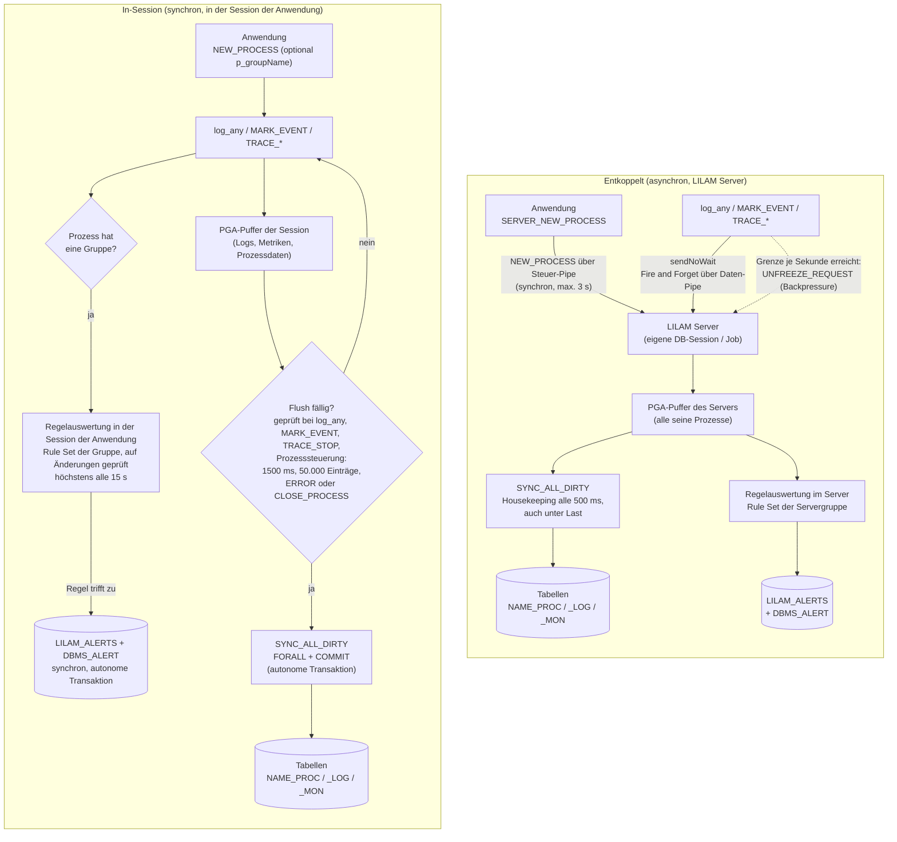
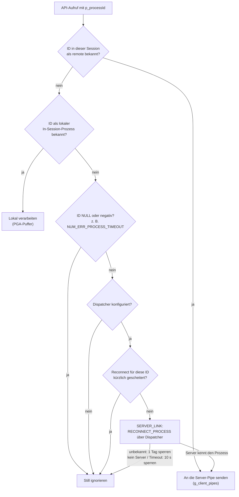
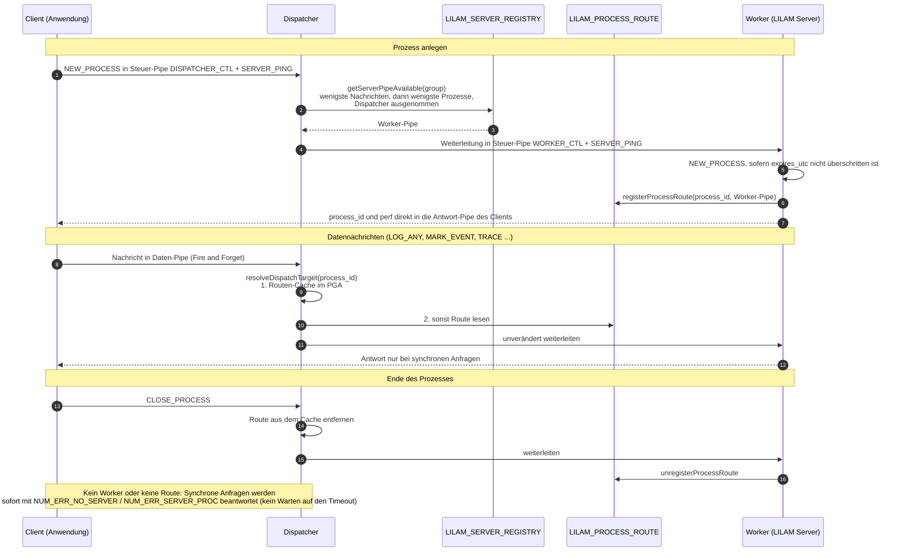
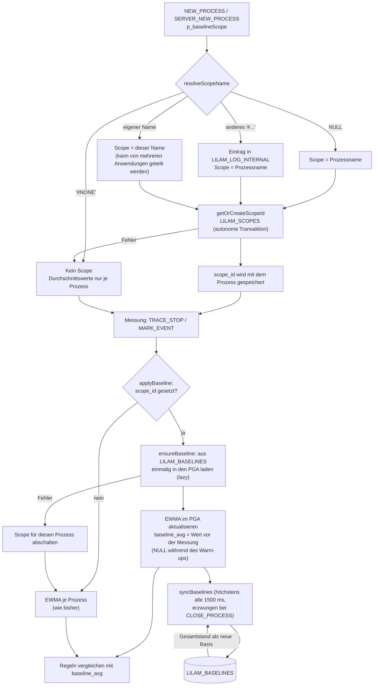

# LILAM Architektur und Konzepte

<details>
<summary>📖<b>Inhalt</b></summary>

- [Technischer Überblick](#technischer-überblick)
- [Begriffe](#begriffe)
  - [Prozess](#prozess)
    - [Lebenszyklus eines Prozesses](#lebenszyklus-eines-prozesses)
  - [Session](#session)
- [Persistenz und Fehlerbehandlung](#persistenz-und-fehlerbehandlung)
- [Logs / Severity](#logs--severity)
- [Log-Level](#log-level)
- [Metriken](#metriken)
  - [Diskrete Events](#diskrete-events)
  - [Transaktions-Tracing](#transaktions-tracing)
  - [Analyse & Ausreißer](#analyse--ausreißer)
- [Regelverwaltung & Reaktion auf Ereignisse](#regelverwaltung--reaktion-auf-ereignisse)
  - [Trigger und Filter](#trigger-und-filter)
      - [Trigger-Typen](#trigger-typen)
      - [Filtermechanismus](#filtermechanismus)
  - [JSON-Struktur](#json-struktur)
- [Betriebsmodi](#betriebsmodi)
  - [In-Session](#in-session)
  - [Entkoppelt](#entkoppelt)
- [Ablaufdiagramme](#ablaufdiagramme)
  - [In-Session und Entkoppelt im Vergleich](#in-session-und-entkoppelt-im-vergleich)
  - [Wie ein API-Aufruf sein Ziel findet](#wie-ein-api-aufruf-sein-ziel-findet)
  - [Ablauf im Dispatcher](#ablauf-im-dispatcher)
  - [Baseline-Scope](#baseline-scope)
- [Tabellen](#tabellen)
  - [Anwendungsspezifische Tabellen](#anwendungsspezifische-tabellen)
  - [Feste interne Tabellen](#feste-interne-tabellen)
  - [Prozesstabelle](#prozesstabelle)
  - [Log-Tabelle](#log-tabelle)
  - [Monitor-Tabelle](#monitor-tabelle)
  - [Registry-Tabelle](#registry-tabelle)
  - [Regeltabelle](#regeltabelle)
  - [Interne Log-Tabelle](#interne-log-tabelle)
- [API](#api)
  - [Prozessverwaltung](#prozessverwaltung)
  - [Prozesssteuerung](#prozesssteuerung)
  - [Logging](#logging-1)
  - [Metriken](#metriken-1)
  - [Serversteuerung](#serversteuerung)

</details>


## Technischer Überblick
LILAM nutzt die Kernfunktionen, die Oracle über PL/SQL bereitstellt (ab Version 12, getestet unter 19c und 26 AI). LILAM selbst ist ein PL/SQL-Skript, das von anderen PL/SQL-Skripten in verschiedenen Betriebsarten genutzt werden kann. Dazu zählen auch APEX-Anwendungen bzw. - allgemein gesprochen - Anwendungen, die zur Laufzeit die Datenbank-Session wechseln können.

LILAM ist damit das Gegenteil von „schwarzer Magie“ oder überzogenem Engineering. Mit wenigen Datenbankobjekten verfolgt LILAM eine konsequente Zero-Dependency-Strategie. Die Sicherheit der Prozess-, Log- und Metrikdaten wird durch autonome Transaktionen gewährleistet. Diese sind streng von den Daten im Speicher und von den Transaktionen anderer Anwendungen getrennt und sorgen für ihren eigenen COMMIT, selbst wenn die Anwendung einen Rollback durchführen musste.

LILAM selbst ist ein PL/SQL Package, bestehend aus der üblichen Spezifikation (.pks) und dem Body (.pkb). Der Code umfasst lediglich einige tausend echte Codezeilen; in Version 2.0, sind es rund 4.500 LOC. Die Funktionen des LILAM Clients, des LILAM Servers und des LILAM Dispatchers sind damit voll abgedeckt.

Für die Installation muss der Code in ein geeignetes DB-Schema kopiert und compiliert werden und es müssen einige Berechtigungen vergeben werden. Mehr dazu in setup.md.

**Programmatisch vs. deklarativ:** Wo immer möglich, habe ich versucht, LILAM so zu entwickeln, dass es ohne Konfigurationstabellen, -dateien oder Ähnliches auskommt. Mein Ziel war vielmehr, das Verhalten des Werkzeugs über die API zu steuern, also programmatisch. Als Entwickler weiß ich, wie lästig es sein kann, sich stundenlang durch Vorbereitungen kämpfen zu müssen, bevor man endlich „zur Sache“ kommt. 

Lediglich für den unkomplizierten Einstieg und Tests existieren Startskripte.

---

## Begriffe
Zunächst einige wichtige Begriffsklärungen im Kontext von LILAM.

### Prozess
LILAM dient zur Überwachung von Anwendungen, die letztlich einen Prozess irgendeiner Art abbilden. Ein Prozess ist also etwas, das sich mit Software abbilden oder darstellen lässt. Im Sinne von LILAM legt der Entwickler fest, wann ein Prozess beginnt und wann er endet. 
Zu einem Prozess gehören insbesondere sein Name, Informationen zu seinem Lebenszyklus sowie geplante und erledigte Arbeitsschritte. 

Eine Anwendung kann mehrere Prozesse gleichzeitig führen, auch in derselben Datenbanksession: Jeder Aufruf von `NEW_PROCESS` bzw. `SERVER_NEW_PROCESS` startet einen eigenen Prozess mit eigener Prozess-ID, den LILAM unabhängig von den anderen überwacht.

#### Lebenszyklus eines Prozesses
Ein Prozess wird einmal gestartet und einmal geschlossen. Für saubere, nachvollziehbare und konsistente Prozesszustände ist das finale Schließen unverzichtbar.

### Session
Mit Session ist in LILAM immer die Datenbanksession (Oracle-Session) gemeint. Eine Anwendung läuft in einer Datenbanksession, ebenso jeder LILAM Server. Eine Datenbanksession kann beliebig viele Prozesse führen. Umgekehrt kann ein Prozess über den Dispatcher in mehreren Datenbanksessions fortgesetzt werden, z. B. bei APEX, wo aufeinanderfolgende Seitenaufrufe in verschiedenen Sessions eines Connection-Pools laufen. Im In-Session-Modus liegen die Puffer eines Prozesses im Speicher (PGA) der Datenbanksession, die ihn gestartet hat.

### LILAM
**LILAM** **I**s **L**ogging **A**nd **M**onitoring. Und mehr.
Ein PL/SQL Package, das ausschließlich Oracle-Mechanismen nutzt.

### LILAM Server
Ein eigenständiger entkoppelter Datenbankprozess, dessen Code-Basis das Package `LILAM` ist.
Der LILAM Server bietet einer oder mehreren Anwendungen die Funktionalitäten von LILAM im entkoppelten `DECOUPLED` Modus an (s.u.). Die Anwendungen können sowohl im selben Schema wie der Server als auch in einem anderen Schema liegen.
Einen LILAM Server können gleichzeitig mehrere Anwendungen nutzen.
LILAM Server laufen idealerweise als Scheduled Job. Der Start eines Servers wird durch die API unterstützt.

### LILAM Client
Ein LILAM Client ist eine Anwendung, die den LILAM Server über eine Kommunikationsschnittstelle steuert. Dazu bedient sich die Anwendung ebenfalls des Packages `LILAM`.
LILAM Client und LILAM Server bieten weitgehend gleiche Funktionalitäten in Bezug auf Logging, Monitoring und Observability.

### IN-SESSION Modus
Nutzt eine Anwendung die Features von LILAM innerhalb derselben Datenbank-Session, d.h. sie teilt sich mit LILAM den Datenbank-Speicherbereich, spreche ich vom IN-SESSION Modus.
Der Programm-Kontrollfluss ist synchron, d.h. die Anwendung setzt ihre Arbeit erst nach Rückkehr eines Aufruf der LILAM-API fort.

### DECOUPLED Modus
Nutzt eine Anwendung die Features von LILAM auf Basis des LILAM Servers, sind die Datenbank-Sessions von Anwendung und Server unabhängig voneinander. Autonome Verarbeitungsschritte von Anwendunng und Server sind zeitlich entkoppelt, beide teilen sich nicht die Datenzustände des jeweils anderen.

### HYBRID Modus
Eine Anwendung kann LILAM gleichzeitig im `DECOUPLED` und im `IN-SESSION` Modus nutzen. Allerdings mit der Einschränkung dass dazu ein jeweils eigenständiger Prozess gestartet wird, was allerdings dank der API sehr unkompliziert zu implementieren ist.

### LILAM Dispatcher
Ein Dispatcher ist ein spezialisierter LILAM Server, der für eine konkrete Aufgabe entwickelt wurde.
Der Dispatcher ermöglicht einer Anwendung mit Connection Pooling (z.B. APEX), Prozesse über die Grenzen physischer Sessions hinaus fortzuführen (automatischer Reconnect).
Der Dispatcher selbst verarbeitet keine Nachrichten, sondern leitet sie an einen LILAM Server der ihm zugewiesenen Gruppe weiter. Die Antworten der Server gehen direkt zurück an die Anwendungen, nicht an den Dispatcher.

### Baseline
Die Baseline ist der Normalwert einer Action und wird als Basis für die Berechnung des gleitenden Durchschnitts herangezogen.
Jede neue Messung innerhalb einer Regel nutzt die Baseline, um Ausreißer zu erkennen. Solange noch zu wenige Messungen in der sog. Warm-Up Phase vorliegen, gibt es keine Baseline, und die Regel greift nicht.

### Baseline-Scope
Der Baseline-Scope legt fest, wer sich eine Baseline teilt. Standardmäßig sind das alle Prozesse mit demselben Namen, sodass jeder neue Lauf auf den Erfahrungen seiner Vorgänger aufbaut.
Ohne Scope lernt jeder Prozess für sich allein, mit einem Scope teilen sich mehrere Anwendungen bewusst einen Normalwert.

---

## Persistenz und Fehlerbehandlung
LILAM schreibt gepufferte Daten gebündelt: Ein Flush sammelt die anstehenden Log-, Monitor- und Prozessdaten aller Prozesse, schreibt jede Tabelle mit einem einzigen `FORALL` und committet alles gemeinsam in einer autonomen Transaktion.

Schlägt ein Bulk-Insert fehl (z. B. weil eine Zeile einen Constraint der Anwendungstabellen verletzt), verliert LILAM die übrigen Zeilen nicht:
1. Das fehlgeschlagene `FORALL` wird zurückgerollt (auf einen Savepoint je Tabelle).
2. Anschließend werden die Zeilen einzeln geschrieben. Eine fehlerhafte Zeile wird übersprungen und in `LILAM_LOG_INTERNAL` vermerkt („row n skipped“); alle anderen Zeilen werden gespeichert.
3. Fehlt die Tabelle selbst (ORA-00942), bricht der zeilenweise Durchlauf sofort ab.

LILAM verwendet bewusst kein `FORALL ... SAVE EXCEPTIONS`: Bei dynamischem SQL gibt Oracle den PGA-Speicher für die Exception-Liste nicht bei jedem Aufruf frei (etwa 40 Bytes je Zeile). In einem lange laufenden Server ließ das den Speicher stetig wachsen. Der oben beschriebene Rückfallweg liefert dasselbe Ergebnis ohne diesen Effekt. Der Test FEATURES/SPEICHER prüft, dass der Speicher je Prozess konstant bleibt.

Wie überall in LILAM erreichen solche Fehler die Anwendung nie: Sie werden intern protokolliert, und die Verarbeitung läuft weiter.

### Wann wird ein Log-Eintrag gespeichert? (Sync-Level)
Die Pufferung macht LILAM schnell, aber ein gepufferter Eintrag existiert bis zum nächsten Flush nur im Speicher. Was einen harten Ausfall übersteht, hängt daher vom **Sync-Level** des Prozesses ab: Einträge bis zu diesem Level werden synchron geschrieben, alle anderen gepuffert. Der Sync-Level wird beim Start des Prozesses mit `p_syncLevel` (bzw. `t_process_init.syncLevel`, JSON `sync_level`) festgelegt. Standard ist `logLevelError`; `logLevelWarn` macht auch `WARN` synchron, `logLevelSilent` schaltet das synchrone Schreiben ab.

| Daten | In-Session | Entkoppelt (Server, auch über Dispatcher) |
| --- | --- | --- |
| Einträge bis zum Sync-Level (Standard: `ERROR`) | Werden **vor der Rückkehr des Aufrufs** geschrieben und committet (autonome Transaktion). Der Aufruf erzwingt einen Flush **aller** gepufferten Daten der Datenbanksession: Logs, Metriken und Prozessstatus jedes offenen Prozesses. | **Doppelter Boden:** Der Client schreibt den Eintrag **vor der Rückkehr des Aufrufs** zusätzlich selbst in einer autonomen Transaktion, und zwar immer in **`LILAM_LOG`** seiner eigenen LILAM-Installation (wird bei Bedarf angelegt), mit `NO = -1` und der Prozess-ID. Anschließend sendet er die Meldung wie gewohnt an den Server: Der Server schreibt sie in die Arbeitstabelle des Prozesses (mit seiner normalen laufenden Nummer), wertet die Regeln aus und schreibt seine Puffer weg. Im Normalfall ist der Eintrag daher zweimal gespeichert. |
| Alle anderen Einträge, Metriken, Prozessstatus | Im PGA der Session gepuffert. Geschrieben, wenn der letzte Flush mindestens 1,5 s zurückliegt oder 50.000 Einträge anstehen, außerdem durch einen synchronen Eintrag, `CLOSE_PROCESS` und `FLUSH`. | Über die Pipe gesendet, im PGA des Servers gepuffert, nach denselben Regeln geschrieben, zusätzlich durch das Housekeeping des Servers (alle 0,5 s) und, wenn seine Pipe leer ist, durch den Leerlauf-Flush (höchstens alle 200 ms). |

Warum `LILAM_LOG` und nicht die Arbeitstabelle des Prozesses? Die Arbeitstabelle kann im Schema des Servers liegen, auf das der Client keinen Zugriff hat, und wo der doppelte Boden landet, soll nicht von Modi, Schemata und Berechtigungen abhängen. Die Regel ist einfach: Alle Einträge stehen wie gewohnt in der Arbeitstabelle; **ist der LILAM Server ausgefallen, stehen die synchronen Einträge zusätzlich in `LILAM_LOG` im Schema des Clients** (`NO = -1`, gleiche `PROCESS_ID`).

Der Server teilt dem Client Log-Level und Sync-Level eines Prozesses mit, wenn der Prozess angelegt (`SERVER_NEW_PROCESS`) oder wieder verbunden wird (Dispatcher, APEX). Ohne diese Werte (z. B. bei einem Server einer älteren Version) sendet der Client alles über die Pipe.

> [!NOTE]
> Die Spalte `NO` ist die laufende Nummer, die der Server je Prozess vergibt. Einträge, die ein entkoppelter Client direkt schreibt, haben `NO = -1`.

Der zeitgesteuerte Flush hat keinen Hintergrund-Timer: Er wird nur geprüft, wenn die Session LILAM erneut aufruft. Im In-Session-Modus stößt jeder Log-Aufruf sowie `MARK_EVENT`, `TRACE_STOP` und die Aufrufe der Prozesssteuerung (`SET_PROCESS_STATUS`, `SET_PROC_STEPS_TODO`, `SET_PROC_STEPS_DONE`, `PROC_STEP_DONE`, `SET_PROC_IMMORTAL`) diese Prüfung an (`TRACE_START` nicht), sodass auch reine Monitoring-Anwendungen, die nie loggen, geschrieben werden. Auf dem Server rufen diese Handler die internen Prozeduren ohne die Prüfung auf; dort schreibt die Server-Loop. Die Prüfung läuft höchstens alle 500 ms je Datenbanksession; prozessübergreifende Baselines werden höchstens alle 1,5 s abgeglichen. Eine Session, die LILAM nicht mehr aufruft, behält ihren Puffer, egal wie lange sie wartet: **Im In-Session-Modus werden Daten nur durch `CLOSE_PROCESS` (der Prozess endet) oder `FLUSH` (der Prozess bleibt offen) garantiert geschrieben.** Bei einem Connection-Pool (APEX/ORDS) oder bei Prozessen, die sich über mehrere Seitenaufrufe oder Datenbanksessions erstrecken (z. B. AJAX-Seiten, die nur tracen oder Fortschritt melden, während eine abschließende Seite `CLOSE_PROCESS` aufruft), verwende den entkoppelten Server zusammen mit dem Dispatcher.

Gemessen auf Oracle 23.26 Free (2 CPU-Threads), Testschema `LILAM_TEST`:

| Messung | Ergebnis |
| --- | --- |
| In-Session: `INFO` | 0,06 ms je Aufruf |
| In-Session: `ERROR`, ein offener Prozess | 1,8–3,2 ms je Aufruf |
| In-Session: 10 × `INFO` in 10 Prozessen + 1 × `ERROR` | 6,1 ms je Runde (`ERROR` schreibt alle 11 Prozesse weg) |
| In-Session: `INFO` → `ERROR` → Aufrufer `ROLLBACK` | das `ERROR` und das `INFO` davor sind gespeichert |
| Entkoppelt: `INFO` (Client) | 0,1–0,4 ms je Aufruf |
| Entkoppelt: `ERROR` (Client, direktes Schreiben) | 1,3–3,6 ms je Aufruf; zum Vergleich: ein einfacher autonomer Insert mit Commit kostet auf diesem System 1,3 ms |
| Entkoppelt: `ERROR` sichtbar in `LILAM_LOG` | unmittelbar nach dem Aufruf |
| Entkoppelt: `INFO` sichtbar in der Tabelle | meist innerhalb von 0,4 s (Leerlauf-Flush; über Dispatcher nach einer Pause: Median 31 ms, max. 371 ms, Lauf 1918) |

**Was bei einem Ausfall verloren geht** (Standard-Sync-Level `ERROR`)

| Ausfall | In-Session | Entkoppelt |
| --- | --- | --- |
| `ROLLBACK` des Aufrufers | Nichts. Alle Schreibvorgänge sind autonome Transaktionen. | Nichts. |
| Unbehandelte Exception, Session beendet (killed), Job abgebrochen, ohne `CLOSE_PROCESS` / `FLUSH` | Alles, was seit dem letzten Flush gepuffert wurde (z. B. `INFO` und `WARN`). Ein `ERROR`, dessen Aufruf zurückgekehrt ist, ist gespeichert, zusammen mit allem, was davor gepuffert war. | Nichts auf Seiten des Clients. Einträge, die den Server erreicht haben, gehen nur verloren, wenn der Server ausfällt. |
| Datenbanksession stirbt während des `ERROR`-Aufrufs | Dieses `ERROR` (es wird am Ende des Aufrufs committet). | Dieses `ERROR`, falls es noch nicht committet war. |
| LILAM Server beendet (killed) oder abgestürzt | – | Alles im Puffer des Servers und in seiner Pipe, also gepufferte Einträge oberhalb des Sync-Levels. Die Pipe liegt nur in der SGA, und ein neu gestarteter Server leert seine Pipe und kennt die Prozesse seines Vorgängers nicht. Synchrone Einträge sind in `LILAM_LOG` des Clients gespeichert (durch Test bestätigt: ein `ERROR`, das gesendet wurde, während der Server nicht lief, ist dort vorhanden). |
| Absturz der Instanz | Alles Gepufferte. | Alles Gepufferte und alles in den Pipes. |
| Pipe voll (Server überlastet) | – | Der Client versucht es einige Sekunden lang erneut und verwirft die Meldung dann. Das wird in `LILAM_LOG_INTERNAL` des Clients vermerkt; die Anwendung erhält keine Exception. Synchrone Einträge sind in `LILAM_LOG` des Clients gespeichert. |
| Log-Tabelle nicht beschreibbar (z. B. Tablespace voll) | Der Eintrag wird in `LILAM_LOG_INTERNAL` vermerkt; die Anwendung erhält keine Exception. | Ebenso, im Client bzw. im Server. |

**Konsequenzen**
* Sobald ein Aufruf mit einem Level bis zum Sync-Level zurückkehrt, ist der Eintrag committet, in beiden Modi. Die Mehrkosten gegenüber einem gepufferten Eintrag entfallen größtenteils auf den Commit.
* Wähle `logLevelWarn` als Sync-Level, wenn auch Warnungen einen Ausfall überstehen müssen. Jeder synchrone Eintrag kostet einige Millisekunden; häufige Level (`INFO`, `DEBUG`) sollten daher gepuffert bleiben.
* Rufe `CLOSE_PROCESS` immer im zentralen Exception-Handler auf, oder `FLUSH`, wenn der Prozess weiterlaufen soll (z. B. wenn eine AJAX-Seite weiterarbeitet). Andernfalls gehen gepufferte Einträge aus der Zeit vor dem Ausfall verloren.

---
## Logs / Severity
Das sind die üblichen Verdächtigen: SILENT, ERROR, WARN, INFO, DEBUG (in der Reihenfolge ihres Gewichts). Muss ich noch mehr sagen? 
Letztlich entscheidet der Entwickler, welche Severity er einem Ereignis in seinem Prozessablauf zuordnet. 
Beim Protokollieren von Prozess-Logs sind die Severity, der Zeitstempel und möglichst aussagekräftige Detailinformationen wichtig.

---
## Log-Level
Abhängig vom Log-Level werden Log-Meldungen entweder verarbeitet oder ignoriert. 
LILAM hat eine Ausnahme, den **Metrik-Level** (logLevelMonitor): In der Hierarchie liegt dieser Level an der Meldeschwelle direkt nach WARN und vor INFO. Ist also „nur“ WARN aktiviert, werden Metrikmeldungen ignoriert; ist INFO aktiviert, werden alle niedrigeren Meldungen (wie DEBUG und TRACE) ignoriert (Operational Insight). 

Für jeden Prozess kann ein anderer Log-Level gewählt werden.

---
## Metriken
LILAM erfasst detaillierte Prozessschritte, indem es ihre **Häufigkeit** und ihre **Dauer** misst. Ein Prozess kann beliebig viele benannte Actions enthalten, die jeweils mehrfach auftreten. 

### Diskrete Events
**MARK_EVENT:** Erfasst einen Meilenstein zu einem Zeitpunkt. LILAM misst die Zeitspannen zwischen aufeinanderfolgenden Vorkommen derselben Action.

### Transaktions-Tracing
**TRACE:** Misst die konkrete Dauer eines Arbeitsschritts vom Start bis zum Ende.

### Analyse & Ausreißer
Für jede Action führt LILAM einen **gleitenden Durchschnitt**. Dieser Durchschnitt wird mit jedem neuen Eintrag festgehalten und ermöglicht so eine Performance-Verfolgung in Echtzeit. Weicht ein Trace deutlich von dieser Baseline ab, wertet LILAM Deine eigenen JSON-Rule-Sets aus, um automatisch **Alerts** auszulösen (Tabelle `LILAM_ALERTS` und ein `DBMS_ALERT`-Signal an den Consumer).

**Beispiel:**
Ein Prozess überwacht die Actions **'A'** und **'B'**:
*   Action **'A'** wird mehrfach als Meilenstein gemeldet. LILAM verfolgt die Anzahl und die Intervalle zwischen diesen Events.
*   Action **'B'** ist eine zeitlich gemessene Transaktion (Trace). LILAM verfolgt die genaue Dauer jeder Ausführung von 'B'.
*   **Ergebnisse:** Summen, Zeitverläufe und Durchschnitte für 'A' und 'B' werden unabhängig voneinander geführt und ergeben ein klares Bild der Prozessstabilität.

---
## Regelverwaltung & Reaktion auf Ereignisse
**Regeln** legen fest, wie LILAM Server auf eingehende **Signale** reagieren, und machen LILAM so von einem passiven Monitoring-Werkzeug zu einem aktiven **Orchestrator**. Die vollständige Referenz (Eigenschaften, Operatoren, Beispiele) steht in [Rules Engine](../rules/README.md).

Regeln sind in **Rule Sets** organisiert, die als JSON-Objekte aufgebaut sind. Die zentrale Tabelle `LILAM_RULES` speichert jedes Rule Set mit seiner **Gruppe**, seinem Namen und seiner **Version**. Je Gruppe ist genau ein Rule Set aktiv (`IS_ACTIVE`). Jeder LILAM Server lädt beim Start und beim Aufruf von `SERVER_UPDATE_RULES` das aktive Rule Set seiner Gruppe; ein neuer Server der Gruppe verwendet daher automatisch dieselben Regeln.

### Regeln im INSESSION-Modus
Auch INSESSION-Prozesse werten Regeln aus, wenn `NEW_PROCESS` eine Gruppe erhält (`p_groupName` bzw. `t_process_init.groupName`); ohne Gruppe haben sie keine Regeln. Sie verwenden dasselbe aktive Rule Set der Gruppe wie die Server.

*   **Laden:** Die erste Regelprüfung eines Prozesses lädt das aktive Rule Set der Gruppe in den Speicher der Datenbanksession. Weitere Prozesse der Gruppe in dieser Session verwenden es mit. Mehrere Gruppen in einer Session bleiben getrennt: Intern erhält jeder Schlüssel die Gruppe als Präfix (`GROUP|Action|Context`); das Rule Set selbst bleibt unverändert.
*   **Änderungen:** Es gibt keinen Timer. Höchstens alle 15 Sekunden (`C_RULES_CHECK_INTERVAL_MS`) prüft ein API-Aufruf Name und Version des aktiven Rule Sets mit einer kleinen indizierten Abfrage und lädt nur neu, wenn sie sich geändert haben. Server werden durch `SERVER_UPDATE_RULES` benachrichtigt und führen zusätzlich dieselbe Prüfung in ihrem Housekeeping aus, sodass ein Server, der die Benachrichtigung verpasst hat (z. B. volle Pipe), innerhalb von etwa 20 Sekunden nachzieht.
*   **Ungültige Rule Sets** werden abgelehnt, einmal je Version in `LILAM_LOG_INTERNAL` protokolliert, und die bisherigen Regeln bleiben aktiv. Fehler erreichen die Anwendung nie.
*   **Latenz:** Ohne Treffer besteht eine Regelprüfung aus einigen Zugriffen auf assoziative Arrays; Actions ohne Regeln kosten ein `EXISTS`, Prozesse ohne Gruppe nichts. Ein ausgelöster Alert wird synchron geschrieben (`LILAM_ALERTS`, `DBMS_ALERT`-Signal, autonome Transaktion), was die Anwendung einen Commit je Alert kostet. `throttle_seconds` begrenzt, wie oft das geschieht.
*   **Zustand je Session:** Die Drosselung und der Vorgänger für `PRECEDED_BY` liegen in der Datenbanksession. Mit Connection-Pools (z. B. APEX) kann derselbe Alert daher einmal je Pool-Verbindung ausgelöst werden.

### Trigger und Filter
Jede Regel ist einem **Trigger-Typ** zugeordnet, der das Signal festlegt, das die Auswertung startet.

#### Trigger-Typen
*   **`PROCESS_START`**: Ein Prozess startet.
*   **`PROCESS_UPDATE`**: Statusänderungen oder Fortschrittsmeldungen (z. B. Schrittzähler).
*   **`PROCESS_STOP`**: Ein Prozess wird geschlossen; die Regel sieht die an `CLOSE_PROCESS` übergebenen Endwerte.
*   **`MARK_EVENT`**: Ein Meilenstein zu einem Zeitpunkt (Marker) trifft ein.
*   **`TRACE_START`**: Eine Zeitmessung (Transaktion) beginnt. Nützlich für Vorabprüfungen.
*   **`TRACE_STOP`**: Eine Transaktion ist abgeschlossen. Ideal für die Analyse von Ausführungszeiten.
*   **`LOGGING`**: Eine Log-Meldung trifft ein (`ERROR`, `WARN`, `INFO`, ...).

Regeln für `MARK_EVENT` und `TRACE_STOP` benötigen den Log-Level `logLevelMonitor` oder höher; Regeln für `TRACE_START` und `LOGGING` funktionieren bei jedem Log-Level.

#### Filtermechanismus
Der Server, und im INSESSION-Modus die Datenbanksession, hält die Regeln in assoziativen Arrays im Speicher und wertet sie in zwei Schritten aus:
1.  **Kontext-Regeln (`Action|Context`):** Regeln für die exakte Kombination aus Action und Context (z. B. `STATION_EXIT` an der Station `Moulin Rouge`).
2.  **Action-Regeln (`Action`):** Regeln ohne Context gelten für **alle** Contexts der Action und werden zusätzlich ausgewertet.

Regeln für andere Actions kosten nichts. Derselben Action und demselben Trigger können mehrere Regeln zugeordnet werden; LILAM wertet sie nacheinander aus. Ein Fehler in einer Regel verhindert die Auswertung der anderen nicht.

### Bedingungs- & Operator-Matrix
#### Prozessmetriken
**Trigger:** PROCESS_START, PROCESS_UPDATE, PROCESS_STOP. Diese Regeln bewerten den Zustand eines Prozesses (Master-Tabelle). Die Action der Regel ist der Prozessname.

| Metrik         | Operatorname (JSON)    | Technische Bedingung                              | Anwendungsfall                                 |
| :------------- | :--------------------- | :------------------------------------------------ | :--------------------------------------------- |
| **Laufzeit**   | `RUNTIME_EXCEEDED`     | `(SYSTIMESTAMP - PROCESS_START) > value` ms (PROCESS_UPDATE) | Prozess läuft zu lange (geprüft, wenn ein Signal eintrifft). |
| **Laufzeit**   | `MAX_RUNTIME_EXCEEDED` | `(PROCESS_END - PROCESS_START) > value` ms (PROCESS_STOP) | Prozess hat zu lange gedauert.         |
| **Fortschritt** | `STEPS_LEFT_HIGH`     | `(STEPS_TODO - STEPS_DONE) > value`               | Prüfung auf unerledigte Arbeit am Prozessende. |
| **Effizienz**  | `SUCCESS_RATE_LOW`     | `(STEPS_DONE / STEPS_TODO) * 100 < value`         | Qualität der Batch-Verarbeitung überwachen.    |
| **Häufigkeit** | `MAX_OCCURRENCE`       | `STEPS_DONE > value`                              | Flutschutz / Erkennung von Endlosschleifen.    |
| **Status**     | `STATUS_EQUALS`        | `STATUS = value`                                  | Auf bestimmte Fehlerstatuscodes reagieren.     |
| **Infotext**   | `INFO_CONTAINS`        | `UPPER(INFO)` enthält `UPPER(value)`              | Suche nach Schlüsselwörtern wie "FATAL" oder "ERROR". |
| **Trigger**    | `ON_START`, `ON_UPDATE`, `ON_STOP` | Trigger ausgelöst                     | Start, Fortschritt oder Ende an nachgelagerte Systeme melden. |
| **Abhängigkeit** | `PRECEDED_BY`        | letztes Event/letzter Trace des Prozesses ≠ `value` (PROCESS_UPDATE, PROCESS_STOP) | Prüft den Vorgänger. |
| **Abhängigkeit** | `PRECEDED_BY_WITHIN_SECS` | wie `PRECEDED_BY`, zusätzlich maximale Verzögerung | Prüft Vorgänger und max. Verzögerung. |

#### Action- & Context-Metriken
**Trigger:** TRACE_START, TRACE_STOP, MARK_EVENT. Diese Regeln bewerten die Daten der Monitor-Tabelle.

| Metrik          | Operatorname (JSON)   | Technische Bedingung                            | Anwendungsfall                                |
| :-------------- | :-------------------- | :---------------------------------------------- | :-------------------------------------------- |
| **Ausführung**  | `ON_EVENT`, `ON_START`, `ON_STOP` | Trigger ausgelöst                   | Einen Orchestrator anstoßen, sobald das Signal eintrifft. |
| **Dauer**       | `MAX_DURATION_MS`     | `used_time > value` (MARK_EVENT, TRACE_STOP)    | Absolute Zeitgrenze für eine bestimmte Action. |
| **Abweichung**  | `AVG_DEVIATION_PCT`   | `used_time > avg_time * (1 + value/100)` (MARK_EVENT, TRACE_STOP); nicht ausgewertet, solange `avg_time` < 1 ms | Relative Abweichung vom gleitenden Durchschnitt. |
| **Häufigkeit**  | `MAX_OCCURRENCE`      | `action_count > value` (MARK_EVENT, TRACE_STOP) | Flutschutz / Erkennung von Endlosschleifen.   |
| **Intervall**   | `MAX_GAP_SECONDS`     | Zeit seit dem vorherigen Event (MARK_EVENT) oder dem Ende des vorherigen Trace (TRACE_START) > value | Stillstand zwischen zwei Signalen erkennen. |
| **Abhängigkeit** | `PRECEDED_BY`        | letztes Event/letzter Trace des Prozesses ≠ `ACTION[\|CONTEXT]` (MARK_EVENT, TRACE_START; nicht TRACE_STOP) | Prüft den Vorgänger.                |
| **Abhängigkeit** | `PRECEDED_BY_WITHIN_SECS` | wie `PRECEDED_BY`, zusätzlich maximale Verzögerung in Sekunden | Prüft Vorgänger und max. Verzögerung. |

#### Logging
**Trigger:** LOGGING.

| Metrik          | Operatorname (JSON)   | Technische Bedingung                            | Anwendungsfall                                |
| :-------------- | :-------------------- | :---------------------------------------------- | :-------------------------------------------- |
| **Level**       | `SEVERITY`            | Level = `value` (`ERROR`, `WARN`, `MONITOR`, `INFO`, `DEBUG`) | Auf jede Meldung eines Levels reagieren. |
| **Log-Text**    | `LOG_CONTAINS`        | `UPPER(Log-Text)` enthält `UPPER(TEXT)`; mit `LEVEL\|TEXT` nur für diesen Level | Log-Meldungen nach Schlüsselwörtern durchsuchen. |

Bei `LOG_CONTAINS` gilt der erste Teil des Werts nur dann als Level, wenn er einer der fünf Level ist; andernfalls ist der ganze Wert der Text (max. 100 Zeichen).

Als Vorgänger für `PRECEDED_BY` zählen nur Events und Traces, keine Log-Meldungen. Die Reihenfolge wird geprüft, wenn eine Action startet; `PRECEDED_BY*` mit `TRACE_STOP` wird beim Laden abgelehnt, weil der Vorgänger dort meist das eigene `TRACE_START` des Trace wäre. Regeln werden ausgewertet, wenn ein Signal eintrifft; es gibt keine zeitgesteuerte Auswertung, daher werden ausbleibende Signale (ein hängender Prozess, ein Event, das nie eintrifft) nicht erkannt.

### JSON-Struktur
Das JSON-Objekt gliedert sich in einen Header für Metadaten und ein Array mit den einzelnen Regeln. Die Drosselung von Alerts wird in Sekunden angegeben:

```json
{
  "header": {
    "rule_set": "SUBWAY_PROD",
    "rule_set_version": 5,
    "description": "Performance rules for Line 1"
  },
  "rules": [
    {
      "id": "R-001",
      "trigger_type": "TRACE_STOP",
      "action": "STATION_EXIT",
      "context": "Moulin Rouge",
      "condition": {
        "operator": "MAX_DURATION_MS",
        "value": "300000"
      },
      "alert": {
        "handler": "LILAM_ALERT_MAIL_LOG",
        "severity": "CRITICAL",
        "throttle_seconds": 900
      }
    }
  ]
}
```

Ein Server prüft ein Rule Set vollständig, bevor er es verwendet. Ist eine Regel ungültig, wird das gesamte Rule Set abgelehnt, und die zuvor geladenen Regeln bleiben aktiv. Werte aus mehreren durch `|` getrennten Teilen dürfen keine leeren Teile enthalten (`|C1`, `A|`, `20||0.3`); unbekannte Eigenschaften (außer solchen, die mit `_` beginnen) sowie Felder, die Objekte, Arrays oder Texte über 4000 Zeichen sind, werden abgelehnt. `CHECK_RULE_SET` führt dieselbe Prüfung durch, ohne das Rule Set zu speichern oder zu aktivieren.

---
## Betriebsmodi
LILAM bietet zwei Betriebsmodi, die Anwendungen nutzen können. Diese Modi lassen sich innerhalb einer Anwendung auch parallel ansprechen – ich nenne das „hybride Nutzung“.

### In-Session
Diese Form der Einbindung ist vermutlich der Standard, wenn es um die Einbindung von PL/SQL-Packages geht. Das „andere“ Package erweitert den Funktionsumfang des Aufrufers; der Programmablauf ist **synchron**, d. h. der Kontrollfluss verlässt das aufrufende Package, setzt sich im aufgerufenen Package fort und kehrt dann zurück. Im In-Session-Modus steht LILAM ausschließlich der Anwendung zur Verfügung.

### Entkoppelt
Das Gegenstück zur synchronen Ausführung im In-Session-Modus ist der **asynchrone** entkoppelte Modus (Decoupled).

In diesem Modus arbeitet LILAM als **LILAM Server**, der Statusänderungen, Logs und Metriken unabhängig vom aufrufenden Programm – dem **LILAM Client** – in die Log-Tabellen schreibt. Mit „Fire & Forget“ über Pipes kann der LILAM Client große Datenmengen in sehr kurzer Zeit abliefern, ohne selbst ausgebremst zu werden.

Dabei sind zwei Ausnahmen zu beachten:

1. LILAM Clients, die den Kanal zum LILAM Server durch eine zu hohe Melderate zu überfluten drohen, werden sanft und vorübergehend – und kaum spürbar – gedrosselt, bis der LILAM Server den Großteil der Last abgearbeitet hat (Backpressure Management). Wohlgemerkt reden wir hier von Größenordnungen im Millisekundenbereich. Die Grenze ist eine Eigenschaft des LILAM Servers: Sie wird beim Start des Servers mit `p_perfServer` festgelegt (`C_SERVER_PERF_LOW` = 500, `C_SERVER_PERF_MID` = 1500 (Standard), `C_SERVER_PERF_HIGH` = 2500 Nachrichten je Prozess und Sekunde oder ein beliebiger anderer Wert; `0` schaltet den Mechanismus ab) und dem Client mitgeteilt, wenn ein Prozess angelegt oder wieder verbunden wird.

2. Das Anlegen eines Prozesses (`SERVER_NEW_PROCESS`) ist synchron, da die Anwendung die Prozess-ID benötigt. Damit das auch unter Last schnell geht, hat jeder LILAM Server eine eigene Steuer-Pipe (`<Pipe-Name>_CTL`), die er vor jeder Datennachricht prüft. Das Anlegen eines Prozesses reiht sich daher nie hinter die Nachrichten anderer Anwendungen ein.

**Server-Loop.** Nach einer Nachricht prüft der Server seine Daten-Pipe einmal, ohne zu warten; ist sie leer, wartet er 1 s, dann 2 s, dann jeweils 5 s (Eco-Modus). Eine eintreffende Nachricht weckt ihn sofort. Timeouts von `DBMS_PIPE` sind ganze Sekunden; Bruchteile werden stillschweigend gerundet (aus 0,2 wird 0), deshalb sind die Stufen ganzzahlig. Das Housekeeping (Registry-Eintrag mit Nachrichtenrate, `SYNC_ALL_DIRTY`) ist zeitgesteuert: alle 500 ms, auch während weiterhin Nachrichten eintreffen, und im Leerlauf beim nächsten Aufwachen.

**Leerlauf-Flush.** Ist die Daten-Pipe leer und hält ein Worker noch ungeschriebene Logs, Metriken oder Prozessdaten, schreibt er sie sofort (`SYNC_ALL_DIRTY` mit Force, ohne den Baseline-Abgleich), statt auf die nächste Eco-Stufe zu warten. Das geschieht höchstens alle 200 ms (`C_SERVER_IDLE_FLUSH_MS`), damit kurze Lücken unter Last nicht jeweils einen Commit verursachen, und nie auf einem Dispatcher (er hält keine Daten). Eine synchrone Anfrage (Reconnect, `SERVER_NEW_PROCESS`, `CLOSE_PROCESS`), die während eines solchen Flush eintrifft, wartet auf ihn (einige Millisekunden). Der Leerlauf-Flush setzt die Zeitsperre von `SYNC_ALL_DIRTY` nicht, sodass das reguläre Housekeeping und der Baseline-Abgleich ihr Intervall behalten. Die Schwelle von 1,5 s je Prozess zählt ab dem letzten Schreibvorgang, der tatsächlich Daten geschrieben hat.

**Herunterfahren.** Bei `SERVER_SHUTDOWN` markiert sich der Server zuerst in der Registry als inaktiv, sodass er nicht mehr gewählt wird. In der Drain-Phase verarbeitet er dann die Nachrichten, die Clients bereits gesendet haben, bis die Daten-Pipe 1 s lang leer bleibt (insgesamt höchstens etwa 5 s). Anschließend schreibt er alle Puffer und entfernt seine Pipes.

3. Aufrufe, die Datenpakete vom LILAM Server anfordern, sind zwangsläufig synchron, wenn die Anwendung die Antwort anschließend selbst verarbeiten will. Denkbar sind hier aber auch Szenarien, in denen zum Beispiel LILAM Client 'A' im Auftrag von LILAM Client 'B' ein Datenpaket vom LILAM Server anfordert. 

Damit würde LILAM Client 'A' zum Producer, der LILAM Server zum Dispatcher und LILAM Client 'C' zum Consumer. **Ein leichtgewichtiges Message-Broker-Muster**

Durch die Möglichkeit, mehrere LILAM Server parallel zu betreiben und gleichzeitig einzelnen Clients die Kommunikation mit mehreren LILAM Servern zu erlauben (und LILAM zusätzlich als Bibliothek einzubinden), ist der Einsatz von LILAM in den unterschiedlichsten Szenarien denkbar. Lastverteilung, Trennung geschäftskritischer und weniger kritischer Anwendungen, Aufteilung nach Abteilungen oder Teams, Mandantenfähigkeit...

---
## Ablaufdiagramme
Die folgenden Diagramme sind aus dem Code in `lilam.pkb` (Version 2.0) abgeleitet. Namen im `code`-Stil sind die internen Prozeduren, die den jeweiligen Schritt ausführen.

### In-Session und Entkoppelt im Vergleich
Die Anwendung verwendet in beiden Modi dieselbe API. Welchen Weg ein Aufruf nimmt, hängt allein von der Prozess-ID ab: `is_remote` prüft, ob die ID zu einem Prozess gehört, der mit `SERVER_NEW_PROCESS` angelegt wurde.



Beide Modi verwenden das aktive Rule Set einer Gruppe aus `LILAM_RULES`. Ein Server lädt es beim Start und bei `SERVER_UPDATE_RULES`; ein In-Session-Prozess hat nur dann Regeln, wenn `NEW_PROCESS` eine Gruppe erhält, und seine Alerts kosten die Anwendung jeweils einen Commit (siehe [Regeln im INSESSION-Modus](#regeln-im-insession-modus)).

### Wie ein API-Aufruf sein Ziel findet
Jeder API-Aufruf mit einer Prozess-ID durchläuft dieselbe Entscheidung (`is_remote`). Ein Reconnect wird nur versucht, wenn ein Dispatcher konfiguriert ist (`SET_DISPATCHER_PIPE`); so kann ein Prozess, der in einer Session angelegt wurde (z. B. in einem APEX-Request), in einer anderen fortgesetzt werden.



### Ablauf im Dispatcher
Ein Dispatcher ist ein LILAM Server, der mit `p_isDispatcher => 1` gestartet wurde. Er verarbeitet selbst nichts (außer `SERVER_SHUTDOWN` und `SERVER_PING`), wertet keine Regeln aus und wird nie als Worker gewählt. Er leitet jede Nachricht unverändert weiter, einschließlich des Antwortkanals des Clients, sodass Worker dem Client direkt antworten.



`SERVER_UPDATE_RULES` umgeht den Dispatcher: `UPDATE_RULE` wird direkt an die Daten-Pipes aller Worker der Gruppe gesendet.

### Baseline-Scope
Die Durchschnittswerte (EWMA) von Traces und Events, mit denen Regeln wie `AVG_DEVIATION_PCT` vergleichen, werden je **Scope** geführt. Standardmäßig ist der Scope der Prozessname, sodass jeder neue Lauf eines Prozesses die Durchschnittswerte seiner Vorgänger fortführt.



`syncBaselines` schreibt nur die eigene Änderung der Session seit dem letzten Abgleich (Delta-Merge) und übernimmt anschließend den Gesamtstand aus der Tabelle. Mit einem Schreiber ist das Ergebnis exakt; mit mehreren parallelen Schreibern (z. B. mehreren Servern oder In-Session-Prozessen mit demselben Scope) ist es eine gute Näherung ohne verlorene Updates. Damit sich parallele Schreiber nicht über Kreuz blockieren (Deadlock), laufen die Updates bestehender Zeilen und die Inserts neuer Zeilen in zwei getrennten Transaktionen, jeweils in aufsteigender Schlüsselreihenfolge. Baselines, die 15 Minuten lang nicht verwendet wurden, werden aus dem PGA entfernt. Auch die Drosselung von Alerts (`throttle_seconds`) wird je Scope geführt, sodass ein Neustart sie nicht zurücksetzt.

---
## Tabellen
LILAM verwendet zwei Kategorien von Tabellen: **anwendungsspezifische Tabellen** für Anwendungsdaten und **feste interne Tabellen** für Framework-weite Funktionen.

#### Anwendungsspezifische Tabellen
Anwendungsspezifische Tabellen speichern Prozesszustand, Logging-Daten und Monitoring-Daten. Ihre Namen werden aus einem gemeinsamen, frei konfigurierbaren Master-Namen (`tabNameMaster`) abgeleitet, an den ein festes Suffix angehängt wird.
Aber Vorsicht! Die Auswahl der Tabellen und ihrer Namen sollte gut geplant sein, um ein Chaos durch eine übermäßige Anzahl verschiedener LILAM-Logging-Tabellen zu vermeiden.


| Zweck | Festes Suffix | Standard-Tabellenname |
| --- | --- | --- |
| Prozessdaten | `_PROC` | `LILAM_PROC` |
| Log-Daten | `_LOG` | `LILAM_LOG` |
| Monitoring-Daten | `_MON` | `LILAM_MON` |

Ist `tabNameMaster` zum Beispiel auf `MY_APPLICATION` gesetzt, verwendet LILAM:

- `MY_APPLICATION_PROC`
- `MY_APPLICATION_LOG`
- `MY_APPLICATION_MON`

> [!IMPORTANT]
> Nur der Master-Name ist konfigurierbar. Die Suffixe `_PROC`, `_LOG` und `_MON` sind fest und definieren die Beziehung zwischen diesen Tabellen.

So können verschiedene Anwendungen, Prozesse oder Umgebungen getrennte Sätze von LILAM-Tabellen verwenden, ohne dass zusätzliche Konfigurationstabellen nötig sind.
Für Betrieb und Nutzdaten sind insgesamt vier Tabellen erforderlich, von denen eine ausschließlich der internen Synchronisation mehrerer LILAM Server dient (dazu später mehr). Der genaue Aufbau dieser Tabellen ist in der README-Datei des LILAM-Projekts auf GitHub beschrieben.


#### Feste interne Tabellen
Zusätzlich zu den prozessspezifischen Tabellen verwendet LILAM interne Tabellen, deren Namen fest sind und nicht geändert werden dürfen.

| Tabelle | Zweck |
| --- | --- |
| `LILAM_SERVER_REGISTRY` | Verwaltet Serverregistrierung, Verfügbarkeit, Heartbeat, Last und Informationen zum aktuell aktiven Rule Set. |
| `LILAM_RULES` | Speichert versionierte Rule Sets je Gruppe (Server und INSESSION-Prozesse), davon je Gruppe eines aktiv. |
| `LILAM_LOG_INTERNAL` | Bietet ein unabhängiges Rückfall-Logging für interne Fehler des LILAM-Frameworks. |

> [!NOTE]
> Feste interne Tabellen gelten Framework-weit und sind unabhängig von `tabNameMaster`.

### Prozesstabelle
**Tabellenkategorie:** Anwendungsspezifische Tabelle

Die Prozesstabelle repräsentiert die Prozesse. Für jeden Prozess gibt es genau einen Eintrag in dieser Master-Tabelle. Während des Lebenszyklus eines Prozesses können sich diese Daten ändern – insbesondere der Zähler für erledigte Prozessschritte (also der Arbeitsfortschritt). Weitere Informationen sind der aktuell für diesen Prozess verwendete Log-Level, der Name des Prozesses sowie die Zeitstempel für Prozessstart, letzte gemeldete Aktualisierung und Abschluss.

#### Tabellenstruktur
Alle Prozesstabellen verwenden unabhängig vom konfigurierten Tabellennamen die folgende Struktur:

| Spalte | Datentyp | Beschreibung |
| --- | --- | --- |
| `ID` | `NUMBER(19)` | Eindeutige Prozess-ID, die beim Initialisieren des Prozesses vergeben wird. Sie dient dazu, Logs, Metriken und nachfolgende API-Aufrufe dem Prozess zuzuordnen. |
| `PROCESS_NAME` | `VARCHAR2(100)` | Von der Anwendung festgelegter Name zur Identifikation des Prozesses. |
| `LOG_LEVEL` | `NUMBER` | Aktiver Log-Level des Prozesses. |
| `PROCESS_START` | `TIMESTAMP(6)` | Zeitstempel, zu dem der Prozess initialisiert wurde. |
| `PROCESS_END` | `TIMESTAMP(6)` | Zeitstempel, zu dem der Prozess abgeschlossen wurde. |
| `LAST_UPDATE` | `TIMESTAMP(6)` | Zeitstempel der letzten Aktualisierung des Prozessdatensatzes. |
| `STEPS_TODO` | `NUMBER` | Geplante Anzahl an Arbeitsschritten des Prozesses. Dieser Wert wird von der aufrufenden Anwendung verwaltet. |
| `STEPS_DONE` | `NUMBER` | Anzahl der erledigten Arbeitsschritte. Dieser Wert wird von der aufrufenden Anwendung über die Process Control API verwaltet. |
| `STATUS` | `NUMBER(2)` | Von der Anwendung festgelegter numerischer Prozessstatus. LILAM weist diesem Wert keine bestimmte Bedeutung zu. |
| `INFO` | `VARCHAR2(2000)` | Von der Anwendung festgelegte Informationen zum Prozess. |
| `PROCESS_IMMORTAL` | `NUMBER(1)` | Gibt an, ob der Prozess vor der automatischen Bereinigung (Retention) geschützt ist. |
| `TAB_NAME_MASTER` | `VARCHAR2(100)` | Dem Prozess zugeordneter Master-Tabellenname, aus dem die zugehörigen LILAM-Tabellennamen abgeleitet werden. |

Die Anzahl der geplanten Schritte sowie der bereits erledigten Schritte steuert die Anwendung, entweder durch explizites Setzen dieser Werte oder über einen API-Trigger.

### Log-Tabelle
**Tabellenkategorie:** Anwendungsspezifische Tabelle

Speichert chronologische Log-Einträge einschließlich Zeitstempeln, Severity-Leveln und detaillierten Diagnoseinformationen. Jeder Eintrag ist über die `PROCESS_ID` mit seinem Prozess verknüpft.

#### Tabellenstruktur
Alle Log-Tabellen verwenden unabhängig vom konfigurierten Tabellennamen die folgende Struktur:

| Spalte | Datentyp | Beschreibung |
| --- | --- | --- |
| `PROCESS_ID` | `NUMBER(19)` | Identifiziert den Prozess, zu dem der Log-Eintrag gehört. |
| `NO` | `NUMBER(19)` | Fortlaufender Zähler je Prozess. Er spiegelt die Reihenfolge wider, in der die Logging-Prozeduren aufgerufen wurden. |
| `INFO` | `VARCHAR2(2000)` | Enthält die eigentliche Log-Meldung. |
| `LOG_LEVEL` | `VARCHAR2(10)` | Numerische Darstellung des Severity-Levels. |
| `LOG_LEVEL_C` | `VARCHAR2(10)` | Textdarstellung des Severity-Levels, z. B. `ERROR`, `WARN`, `INFO` oder `DEBUG`. |
| `SESSION_TIME` | `TIMESTAMP(6)` | Zeitstempel, zu dem der Log-Eintrag erfasst wurde. |
| `SESSION_USER` | `VARCHAR2(50)` | Benutzer der Datenbanksession, ermittelt über `SYS_CONTEXT('USERENV','SESSION_USER')`. |
| `HOST_NAME` | `VARCHAR2(50)` | Client-Host, ermittelt über `SYS_CONTEXT('USERENV','HOST')`. |
| `CALLER` | `VARCHAR2(255)` | Name der aufrufenden Prozedur. |
| `ERR_STACK` | `VARCHAR2(4000)` | Informationen zum Error Stack, sofern vorhanden. |
| `ERR_BACKTRACE` | `VARCHAR2(4000)` | Informationen zum Error Backtrace, sofern vorhanden. |
| `ERR_CALLSTACK` | `VARCHAR2(4000)` | Informationen zum Call Stack, sofern vorhanden. |

### Monitor-Tabelle
**Tabellenkategorie:** Anwendungsspezifische Tabelle

Speichert detaillierte Monitoring-Daten zu Events und Traces. Jeder Eintrag ist über `PROCESS_ID` mit seinem Prozess verknüpft.

Events und Traces teilen sich dieselbe Tabellenstruktur. Die Spalte `MON_TYPE` kennzeichnet die Art des Monitoring-Eintrags, während `ACTION` und `CONTEXT` die überwachte Aktivität kennzeichnen.

#### Tabellenstruktur

| Spalte | Datentyp | Beschreibung |
| --- | --- | --- |
| `PROCESS_ID` | `NUMBER(19)` | Identifiziert den Prozess, zu dem der Monitoring-Eintrag gehört. |
| `MON_TYPE` | `NUMBER` | Kennzeichnet die Monitoring-Art. `0` steht für ein Event. |
| `START_TIME` | `TIMESTAMP(6)` | Zeitstempel, zu dem das Event eintrat bzw. der Trace startete. |
| `STOP_TIME` | `TIMESTAMP(6)` | Zeitstempel, zu dem der Trace endete. Bleibt bei Events `NULL`. |
| `SESSION_USER` | `VARCHAR2(50)` | Benutzer der Datenbanksession, ermittelt über `SYS_CONTEXT('USERENV','SESSION_USER')`. |
| `HOST_NAME` | `VARCHAR2(50)` | Client-Host, ermittelt über `SYS_CONTEXT('USERENV','HOST')`. |
| `ACTION` | `VARCHAR2(100)` | Name der überwachten Action. |
| `CONTEXT` | `VARCHAR2(100)` | Optionaler Context, um Vorkommen derselben Action zu unterscheiden. |
| `USED_MILLIS` | `NUMBER(19)` | Gemessene Dauer in Millisekunden. |
| `AVG_MILLIS` | `NUMBER(19)` | Gleitende durchschnittliche Dauer in Millisekunden für die zugehörige Kombination aus Action und Context. |
| `ACTION_COUNT` | `NUMBER(19)` | Anzahl der erfassten Vorkommen für die zugehörige Kombination aus Action und Context. |


### Registry-Tabelle
**Tabellenkategorie:** Feste interne Tabelle

Die Tabelle `LILAM_SERVER_REGISTRY` verwaltet den Laufzeitzustand der registrierten LILAM Server. Anders als bei den Prozess-, Log- und Monitor-Tabellen ist ihr Name fest und wird nicht aus `tabNameMaster` abgeleitet.

Jeder aktive LILAM Server registriert sich in dieser Tabelle und aktualisiert regelmäßig seine Aktivitätsinformationen. Clients (und Dispatcher) nutzen die Registry, um geeignete Server zu finden und einen Server anhand seiner aktuellen Last auszuwählen: zuerst nach der Anzahl offener Prozesse (`CURRENT_PROCESSES`), dann nach der Nachrichtenrate des letzten Housekeeping-Fensters (`MSG_RATE`, in Stufen zu 100 Nachrichten je Sekunde; eine Rate, deren `RATE_TS` älter als 1,5 s ist, zählt als 0) und schließlich nach dem Server, der am längsten untätig ist (ältester `LAST_ACTIVITY`). Sind offene Prozesse und Rate gleich, wechselt der Aufrufer zwischen den Servern ab (Round Robin je Datenbanksession). Ein Server aktualisiert seinen Eintrag alle 500 ms im Housekeeping und zusätzlich direkt nach jedem neuen und jedem geschlossenen Prozess, damit sich schnell nacheinander angelegte Prozesse auf die Server verteilen.

Bis Oktober 2026 war die rohe Nachrichtenanzahl `PROCESSING` das erste Kriterium. Da jeder Server sie für sein eigenes, nicht abgestimmtes Zeitfenster schreibt, erhielt ein Server mit einer kleineren, aber älteren Anzahl jeden neuen Prozess, bis er seine eigene Anzahl erneut schrieb; Schübe neuer Prozesse konnten im Verhältnis 19:1 auf einem Server landen (Diagnose in `test/autotest/FEATURES/SERVERAUSWAHL/results/2026-10-06_serverauswahl_provokation_ergebnis.md`).

Wird `SERVER_NEW_PROCESS` mit einem `p_groupName` aufgerufen, werden nur Server berücksichtigt, die für die angeforderte Gruppe registriert sind.

#### Tabellenstruktur
> [!NOTE]
> `LAST_ACTIVITY` dient als Heartbeat des Servers. Bei der Serversuche gelten Einträge, die älter als 15 Sekunden sind, als nicht verfügbar.

| Spalte | Datentyp | Beschreibung |
| --- | --- | --- |
| `PIPE_NAME` | `VARCHAR2(50)` | Eindeutiger Pipe-Name, über den der LILAM Server identifiziert und angesprochen wird. |
| `GROUP_NAME` | `VARCHAR2(50)` | Optionale Gruppe, der der Server zugeordnet ist. Dient zur Einschränkung der Serverauswahl, wenn `p_groupName` angegeben ist. |
| `LAST_ACTIVITY` | `TIMESTAMP(3)` | Zeitstempel des letzten Heartbeats bzw. der letzten Aktivität des Servers. Dient zur Feststellung, ob der Server noch verfügbar ist. |
| `CURRENT_PROCESSES` | `NUMBER` | Anzahl der aktuell auf dem Server offenen Prozesse (ohne den eigenen Prozess des Servers). Erstes Kriterium der Serverauswahl. |
| `IS_ACTIVE` | `NUMBER(1)` | Gibt an, ob der Server als aktiv markiert ist. |
| `STATUS` | `VARCHAR2(20)` | Aktueller Status des Servers. |
| `PROCESSING` | `NUMBER` | Anzahl der Nachrichten im letzten Housekeeping-Fenster. Nur zur Überwachung, wird für die Serverauswahl nicht mehr verwendet. |
| `MSG_RATE` | `NUMBER` | Nachrichten je Sekunde im letzten Housekeeping-Fenster. Zweites Kriterium der Serverauswahl. |
| `RATE_TS` | `TIMESTAMP(3)` | Zeitpunkt, zu dem `MSG_RATE` geschrieben wurde. Eine Rate, die älter als 1,5 s ist, zählt als 0. |
| `IS_DISPATCHER` | `NUMBER(1)` | `1` für einen Dispatcher. Dispatcher werden nie als Ziel einer Serverauswahl gewählt, weder von Clients noch von einem anderen Dispatcher. |

### Regeltabelle
**Tabellenkategorie:** Feste interne Tabelle

Regeln legen fest, wie LILAM auf eingehende Signale reagiert. Sie sind in Rule Sets organisiert, die für maximale Flexibilität als JSON-Objekte aufgebaut sind.

Die zentrale Tabelle `LILAM_RULES` dient als Ablage für diese Konfigurationen. Ihr Name ist fest und wird nicht aus `tabNameMaster` abgeleitet.

Rule Sets werden als JSON-Dokumente gespeichert und über Gruppe, Name und Version identifiziert. So lassen sich verschiedene Versionen desselben Rule Sets pflegen, und dasselbe Rule Set kann für mehrere Gruppen gespeichert werden. Je Gruppe ist genau eine Zeile aktiv; `SERVER_UPDATE_RULES` wechselt die aktive Zeile und informiert die laufenden Server der Gruppe; INSESSION-Prozesse der Gruppe übernehmen sie innerhalb von 15 Sekunden selbst.

#### Tabellenstruktur

| Spalte | Datentyp | Beschreibung |
| --- | --- | --- |
| `RULE_SET` | `CLOB` | Enthält das Rule Set als JSON-Dokument (`IS JSON`). |
| `GROUP_NAME` | `VARCHAR2(50)` | Gruppe, zu der das Rule Set gehört: `GROUP_NAME` der Registry (Server) oder `p_groupName` von `NEW_PROCESS` (INSESSION). |
| `SET_NAME` | `VARCHAR2(30)` | Name zur Identifikation des Rule Sets (Pflicht). |
| `VERSION` | `NUMBER` | Ganzzahlige Version des Rule Sets (Pflicht). |
| `IS_ACTIVE` | `NUMBER(1)` | `1` für das Rule Set, das die Gruppe verwendet (Server und INSESSION-Prozesse); höchstens eines je Gruppe. Sonst `0`. |
| `CREATED` | `TIMESTAMP(6)` | Zeitstempel, zu dem das Rule Set angelegt wurde. |
| `AUTHOR` | `VARCHAR2(50)` | Dem Rule Set zugeordneter Autor. |

`GROUP_NAME` (Pflicht, ohne Unterscheidung von Groß- und Kleinschreibung), `SET_NAME` und `VERSION` sind zusammen eindeutig. Alerts (`LILAM_ALERTS`) verweisen über `GROUP_NAME`, `RULE_SET_NAME`, `RULE_SET_VERSION` und `RULE_ID` auf eine Regel.

### Interne Log-Tabelle
**Tabellenkategorie:** Feste interne Tabelle

Die Tabelle `LILAM_LOG_INTERNAL` stellt einen eigenen Rückfall-Logging-Mechanismus für Fehler bereit, die innerhalb des LILAM-Frameworks selbst auftreten.

Anders als bei den Prozess-, Log- und Monitor-Tabellen ist ihr Name fest und darf nicht geändert werden.

Interne Framework-Fehler dürfen nicht über die regulären Logging-Mechanismen von LILAM verarbeitet werden, da dies zu rekursiven Fehlern führen oder den ursprünglichen Fehler verdecken könnte. Deshalb können hochspezialisierte interne Routinen diese Tabelle bei Bedarf anlegen und Diagnoseinformationen direkt hineinschreiben.

> [!IMPORTANT]
> `LILAM_LOG_INTERNAL` ist ausschließlich für interne Framework-Fehler gedacht. Anwendungs-Logging gehört in die reguläre Log-Tabelle des jeweiligen Prozesses.

#### Tabellenstruktur

| Spalte | Datentyp | Beschreibung |
| --- | --- | --- |
| `ID` | `NUMBER` | Per Identity erzeugte eindeutige Kennung des internen Log-Eintrags. |
| `LOG_TIMESTAMP` | `TIMESTAMP(6)` | Zeitstempel des internen Fehlers. Standardwert ist `SYSTIMESTAMP`. |
| `ERROR_CODE` | `NUMBER` | Oracle-Fehlercode, sofern vorhanden. |
| `ERROR_MESSAGE` | `VARCHAR2(4000)` | Fehlermeldung zum internen Fehler. |
| `ERROR_STACK` | `VARCHAR2(4000)` | Error Stack zum Fehler. |
| `ERROR_BACKTRACE` | `VARCHAR2(4000)` | Error Backtrace zum Fehler. |
| `CALL_STACK` | `VARCHAR2(4000)` | Call Stack zu dem Zeitpunkt, an dem der Fehler erfasst wurde. |
| `MODULE_NAME` | `VARCHAR2(200)` | LILAM-Modul, in dem der Fehler aufgetreten ist. |
| `LOG_OPERATION` | `VARCHAR2(200)` | Interne Operation, die ausgeführt wurde, als der Fehler erfasst wurde. |

---
## API
Die LILAM API besteht aus rund 35 Prozeduren und Funktionen, von denen einige überladen sind. Da die statische Polymorphie das Ergebnis der API-Aufrufe nicht verändert, führe ich im Folgenden nur die Namen der Prozeduren und Funktionen auf. Die API lässt sich in fünf Gruppen einteilen. Eine ausführlichere Darstellung findest Du in ["API_DE.md"](API_DE.md).

**API-Überblick:**

### Prozessverwaltung
* **NEW_PROCESS:** Startet einen neuen Prozess im In-Session-Modus.
* **SERVER_NEW_PROCESS:** Startet einen neuen Prozess, den ein LILAM Server verarbeitet (entkoppelter Modus).
* **CLOSE_PROCESS:** Beendet den Prozess und schreibt seine gepufferten Daten.

### Prozesssteuerung
#### Werte setzen
* **SET_PROCESS_STATUS:** Setzt Informationen zum aktuellen Zustand des Prozesses.
* **SET_PROC_STEPS_TODO:** Setzt den (Anfangs-)Wert der erwarteten Arbeitsschritte des Prozesses.
* **SET_PROC_STEPS_DONE:** Setzt die Anzahl der (bisher) erledigten Arbeitsschritte.
* **PROC_STEP_DONE:** Erhöht den Zähler der erledigten Arbeitsschritte (Steps Done).

#### Werte abfragen
* **GET_PROC_STEPS_DONE:** Ermittelt die Gesamtzahl der bisher erledigten Arbeitsschritte des Prozesses.
* **GET_PROC_STEPS_TODO:** Liefert den zuvor gesetzten Wert der erwarteten Arbeitsschritte.
* **GET_PROCESS_START:** Liefert die Startzeit des Prozesses.
* **GET_PROCESS_END:** Liefert die Endzeit eines Prozesses.
* **GET_PROCESS_STATUS:** Liefert einen Wert, den der Entwickler zuvor nach Bedarf gesetzt hat.
* **GET_PROCESS_INFO:** Liefert Prozessinformationen; außerhalb der Kontrolle von LILAM.
* **GET_PROCESS_DATA:** Liefert alle Prozessdaten in einer festgelegten Struktur.
* **GET_PROCESS_DATA_JSON:** Liefert alle Prozessdaten im JSON-Format.

### Logging
* **INFO:** Meldet eine Nachricht mit der Severity 'Info'.
* **DEBUG:** Meldet eine Nachricht mit der Severity 'Debug'.
* **WARN:** Meldet eine Nachricht mit der Severity 'Warn'.
* **ERROR:** Meldet eine Nachricht mit der Severity 'Error'.

### Metriken
#### Werte setzen
* **MARK_EVENT:** Dokumentiert einen abgeschlossenen Arbeitsschritt einer Action und stößt die Summen- und Zeitberechnungen für diese Actions an.
* **TRACE_START:** Startet eine Dauermessung für einen bestimmten Arbeitsschritt (Trace), indem der Startzeitpunkt im Speicher der Session festgehalten wird.
* **TRACE_STOP:** Beendet die Messung für einen bestimmten Arbeitsschritt (Trace) und schreibt sie in die Monitor-Tabelle.

#### Werte abfragen
* **GET_METRIC_AVG_DURATION:** Liefert die durchschnittliche Verarbeitungsdauer für Actions mit demselben Namen innerhalb eines Prozesses.
* **GET_METRIC_STEPS:** Liefert die aktuelle Anzahl erledigter Arbeitsschritte für Actions mit demselben Namen innerhalb eines Prozesses.

### Serversteuerung
* **START_SERVER:** Startet einen LILAM Server.
* **CREATE_SERVER:** Startet einen LILAM Server als Hintergrundprozess (Job).
* **SERVER_SHUTDOWN:** Fährt einen LILAM Server herunter.
* **GET_SERVER_PIPE:** Liefert den Namen der Pipe, über die mit dem Server kommuniziert wird.
* **SERVER_UPDATE_RULES:** Setzt das verwendete Rule Set ein oder ändert es
* **CHECK_RULE_SET:** Prüft ein Rule Set, ohne es zu speichern oder zu aktivieren (`NULL` = gültig, sonst die Begründung)

