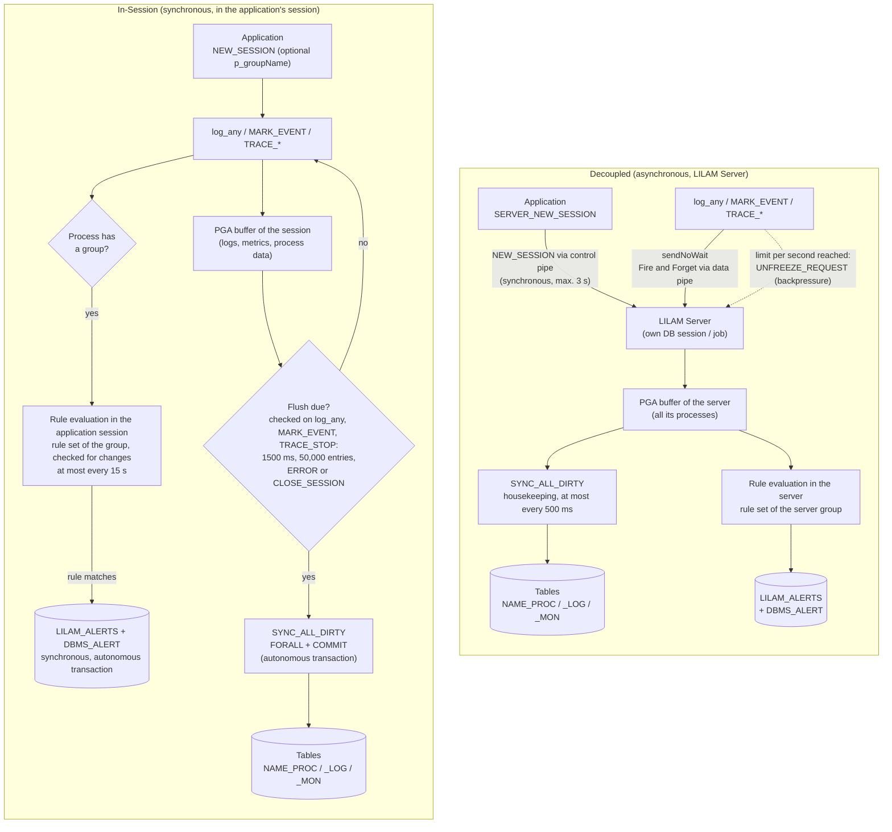
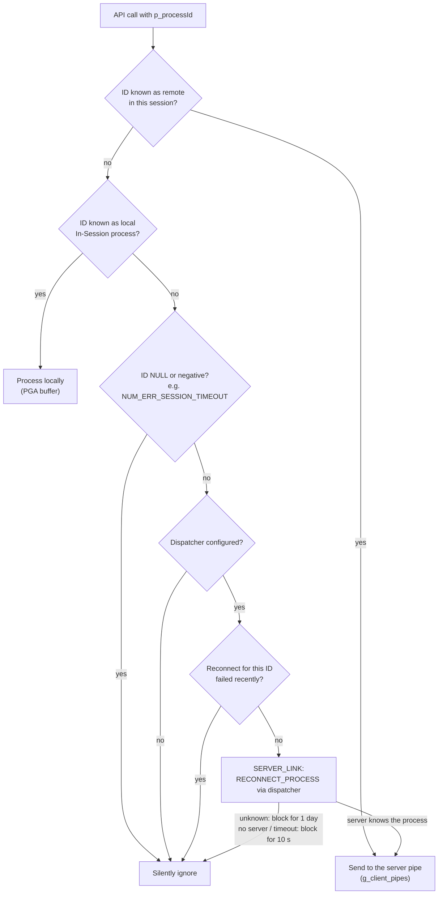
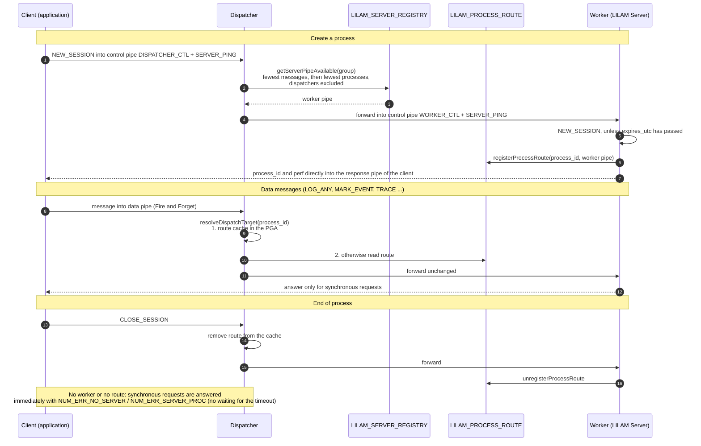
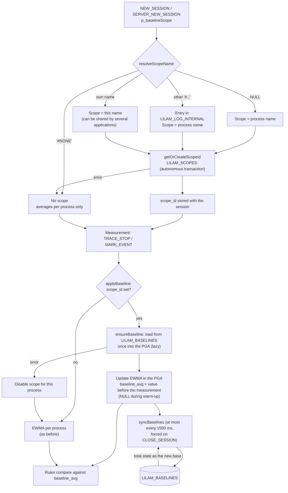

# LILAM Architecture and Concepts

<details>
<summary>📖<b>Content</b></summary>

- [Technical Overview](#technical-overview)
- [Terms](#terms)
- [Process](#process)
- [Session](#session)
  - [Session Life Cycle](#session-life-cycle)
  - [Persistence and Error Handling](#persistence-and-error-handling)
- [Logs / Severity](#logs--severity)
- [Log Level](#log-level)
- [Metrics](#metrics)
  - [Discrete Events](#discrete-events)
  - [Transaction Tracing](#transaction-tracing)
  - [Analysis & Outliers](#analysis--outliers)
- [Rule Management & Event Response](#rule-management--event-response)
  - [Trigger and Filter](#trigger-and-filter)
      - [Trigger Types](#trigger-types)
      - [Filtering Mechanism](#filtering-mechanism)
  - [JSON Structure](#json-structure)
- [Operating Modes](#operating-modes)
  - [In-Session](#in-session)
  - [Decoupled](#decoupled)
- [Flow Diagrams](#flow-diagrams)
  - [In-Session and Decoupled Side by Side](#in-session-and-decoupled-side-by-side)
  - [How an API Call Finds Its Target](#how-an-api-call-finds-its-target)
  - [Dispatcher Flow](#dispatcher-flow)
  - [Baseline Scope](#baseline-scope)
- [Tables](#tables)
  - [Application-Specific Tables](#application-specific-tables)
  - [Fixed Internal Tables](#fixed-internal-tables)
  - [Process Table](#process-table)
  - [Log Table](#log-table)
  - [Monitor Table](#monitor-table)
  - [Registry Table](#registry-table)
  - [Rules Table](#rules-table)
  - [Internal Log Table](#internal-log-table)
- [API](#api)
  - [Session Handling](#session-handling)
  - [Process Control](#process-control)
  - [Logging](#logging)
  - [Metrics](#metrics)
  - [Server Control](#server-control)

</details>


## Technical Overview
LILAM utilizes the core functionalities made available by Oracle through its PL/SQL (from version 12 onwards, tested under 19c and 26 AI). LILAM itself is a PL/SQL script that can be used by other PL/SQL scripts in various modi operandi.

This means LILAM is the opposite of "black magic" or over-the-top engineering. By using less tables, indexes, a sequence, and pipes, LILAM pursues a 100% Zero-Dependency strategy. The security of session, log, and metric data is guaranteed by autonomous transactions. These are sharply separated from data in memory and from the transactions of other applications, ensuring their own COMMIT even if the application had to perform a rollback.

LILAM itself is a package consisting of the usual specification (.pks) and the body (.pkb). The code consists of a few thousand real lines of code; in version 1.3, which already featured most functionalities, it was around 3,000 LOC. The functionalities of the LILAM client and the LILAM server are entirely part of this code.

Installation requires nothing more than copying the code into a suitable DB schema and granting a few permissions. More on this in setup.md.

**Programmatic vs. Declarative:** Whenever possible, I have tried to develop LILAM so that it works without configuration tables, files, or the like. Rather, my goal was for the tool's behavior to be controlled through the API—i.e., programmatically. As a developer, I know how annoying it can be to have to struggle through hours of preparation before finally getting 'down to business.' 

In fact, there are currently no configuration table(s), startup scripts, or similar requirements to use the full scope of LILAM (as of v1.3.0).

---
## Terms
First, some important clarifications of terms within the LILAM context.

---
## Process
LILAM is used to monitor applications that ultimately represent a process of some kind. A process is therefore something that can be mapped or represented with software. Within the meaning of LILAM, the developer determines when a process begins and when it ends. 

A process specifically includes its name, lifecycle information, and planned as well as completed work steps. 

---
## Session
A session represents the lifecycle of a logged process. A process 'lives' within a session. A session is opened once and closed once. For clean, traceable, and consistent process states, the final closing of sessions is indispensable.

### Session Life Cycle
**With the beginning** of a Log Session the one and only log entry is written to the *master table*.
**During** the Session this one log entry can be updated and additional informations can be written to the *detail table*.
**At the end** of a Session the log entry again can be updated.

>**Important Note on Data Persistence:**
>LILAM utilizes high-performance in-memory buffering to minimize database load. Monitoring data and process states are collected in RAM and only persisted to the >database once a threshold (e.g., 100 entries) is reached.
>
>**To guarantee full data integrity, calling CLOSE_SESSION at the end of your process is mandatory.**
>
>If a process terminates abnormally (e.g., due to an uncaught exception) without reaching CLOSE_SESSION, any data remaining in the buffer since the last automatic >flush will be lost. We strongly recommend including CLOSE_SESSION in your application’s central exception handler.

Ultimately, all that is required for a complete life cycle is to call the NEW_SESSION function at the beginning of the session and the CLOSE_SESSION procedure at the end of the session.

### Persistence and Error Handling
LILAM writes buffered data in bulk: one flush collects the pending log, monitor and process data of all processes, writes each table with a single `FORALL` and commits everything together in an autonomous transaction.

If a bulk insert fails (e.g., because a row violates a constraint of the application's tables), LILAM does not lose the other rows:
1. The failed `FORALL` is rolled back (to a savepoint per table).
2. The rows are then written one by one. A faulty row is skipped and recorded in `LILAM_LOG_INTERNAL` ("row n skipped"); all other rows are stored.
3. If the table itself is missing (ORA-00942), the single-row run stops immediately.

LILAM deliberately does not use `FORALL ... SAVE EXCEPTIONS`: with dynamic SQL, Oracle does not release the PGA memory used for the exception list on every call (about 40 bytes per row). In a long-running server this let the memory grow continuously. The fallback above gives the same result without this effect. The test FEATURES/SPEICHER checks that the memory per process stays flat.

As everywhere in LILAM, such errors never reach the application: they are logged internally and processing continues.

### When Is a Log Entry Stored? (Sync Level)
Buffering makes LILAM fast, but a buffered entry only exists in memory until the next flush. What survives a hard failure therefore depends on the **sync level** of the process: entries up to this level are written synchronously, all others are buffered. The sync level is set with `p_syncLevel` (or `t_session_init.syncLevel`, JSON `sync_level`) when the process is started. The default is `logLevelError`; `logLevelWarn` makes `WARN` synchronous as well, `logLevelSilent` switches synchronous writing off.

| Data | In-Session | Decoupled (server, also via dispatcher) |
| --- | --- | --- |
| Entries up to the sync level (default: `ERROR`) | Written and committed **before the call returns** (autonomous transaction). The call forces a flush of **all** buffered data of the database session: logs, metrics and process status of every open process. | **Safety net:** the client additionally writes the entry itself in an autonomous transaction **before the call returns**, always into **`LILAM_LOG`** of its own LILAM installation (created if missing), with `NO = -1` and the process ID. It then sends the message to the server as usual: the server writes it to the work table of the process (with its normal running number), evaluates the rules and flushes its buffers. Normally the entry is therefore stored twice. |
| All other entries, metrics, process status | Buffered in the PGA of the session. Flushed when the last flush is at least 1.5 s ago or 50,000 entries are pending, and also by a synchronous entry, `CLOSE_SESSION` and `FINAL_RESCUE`. | Sent via the pipe, buffered in the PGA of the server, flushed by the same rules plus the server's housekeeping (every 0.5 s when idle). |

Why `LILAM_LOG` and not the work table of the process? The work table may be in the schema of the server, which the client cannot reach, and where the safety net ends up should not depend on modes, schemas and privileges. The rule is simple: all entries are in the work table as usual; **if the LILAM server failed, the synchronous entries are additionally in `LILAM_LOG` of the client's schema** (`NO = -1`, same `PROCESS_ID`).

The server reports log level and sync level of a process to the client when the process is created (`SERVER_NEW_SESSION`) or reconnected (dispatcher, APEX). Without these values (e.g. a server of an older version) the client sends everything via the pipe.

> [!NOTE]
> Column `NO` is the running number that the server assigns per process. Entries written directly by a decoupled client have `NO = -1`.

The time-based flush has no background timer: it is checked only when the session calls LILAM again. In in-session mode every log call as well as `MARK_EVENT` and `TRACE_STOP` triggers this check (`TRACE_START` does not), so pure monitoring applications that never log are flushed as well. The check runs at most every 500 ms per database session; cross-process baselines are synchronized at most every 1.5 s. A session that stops calling LILAM keeps its buffer, however long it waits: **in in-session mode `CLOSE_SESSION` is the only guaranteed write point.** With a connection pool (APEX/ORDS) or processes that span several page requests or database sessions (e.g. AJAX pages that only trace, while a final page calls `CLOSE_SESSION`), use the decoupled server together with the dispatcher.

Measured on Oracle 23.26 Free (2 CPU threads), test schema `LILAM_TEST`:

| Measurement | Result |
| --- | --- |
| In-Session: `INFO` | 0.06 ms per call |
| In-Session: `ERROR`, one open process | 1.8–3.2 ms per call |
| In-Session: 10 × `INFO` in 10 processes + 1 × `ERROR` | 6.1 ms per round (`ERROR` flushes all 11 processes) |
| In-Session: `INFO` → `ERROR` → caller `ROLLBACK` | the `ERROR` and the `INFO` before it are stored |
| Decoupled: `INFO` (client) | 0.1–0.4 ms per call |
| Decoupled: `ERROR` (client, direct write) | 1.3–3.6 ms per call; for comparison, a plain autonomous insert with commit costs 1.3 ms on this system |
| Decoupled: `ERROR` visible in `LILAM_LOG` | immediately after the call |
| Decoupled: `INFO` visible in the table | after about 2 s |

**What is lost in case of a failure** (default sync level `ERROR`)

| Failure | In-Session | Decoupled |
| --- | --- | --- |
| Caller `ROLLBACK` | Nothing. All writes are autonomous transactions. | Nothing. |
| Unhandled exception, session killed, job aborted, without `CLOSE_SESSION` / `FINAL_RESCUE` | Everything buffered since the last flush (e.g. `INFO` and `WARN`). An `ERROR` that has returned is stored, together with everything that was buffered before it. | Nothing on the client side. Entries that have reached the server are lost only if the server fails. |
| Database session dies during the `ERROR` call | This `ERROR` (it is committed at the end of the call). | This `ERROR`, if it was not yet committed. |
| LILAM server killed or crashed | – | Everything in the server's buffer and in its pipe, i.e. buffered entries above the sync level. The pipe lives in the SGA only, and a restarted server empties its pipe and does not know the processes of its predecessor. Synchronous entries are stored in `LILAM_LOG` of the client (verified by test: an `ERROR` sent while the server was down is there). |
| Instance crash | Everything buffered. | Everything buffered and everything in the pipes. |
| Pipe full (server overloaded) | – | The client retries for a few seconds and then discards the message. It is recorded in `LILAM_LOG_INTERNAL` of the client; the application gets no exception. Synchronous entries are stored in `LILAM_LOG` of the client. |
| Log table not writable (e.g. tablespace full) | The entry is recorded in `LILAM_LOG_INTERNAL`; the application gets no exception. | Same, in the client or the server. |

**Consequences**
* Once a call with a level up to the sync level returns, the entry is committed, in both modes. The additional cost compared with a buffered entry is mostly the commit.
* Choose `logLevelWarn` as sync level if warnings must survive a failure as well. Each synchronous entry costs a few milliseconds, so keep frequent levels (`INFO`, `DEBUG`) buffered.
* Always call `CLOSE_SESSION` (or at least `FINAL_RESCUE`) in the central exception handler. Otherwise buffered entries from before the failure are lost.

The session is more of a technical perspective on the workflows within LILAM, while the process is the view 'to the outside.' I believe these two terms—session and process—can be used almost synonymously in daily LILAM operations. It doesn't really hurt if they are mixed a bit.

---
## Logs / Severity
These are the usual suspects; SILENT, ERROR, WARN, INFO, DEBUG (in order of their weight). Need I say more? 
Ultimately, the developer decides which severity level to assign to an event in their process flow. 
Regarding the logging of process logs, the severity, the timestamp, and the most descriptive detail information possible are important.

---
## Log Level
Depending on the log level, log messages are either processed or ignored. 
LILAM has one exception, the **Metric Level** (logLevelMonitor): In the hierarchy, this level sits at the threshold for reporting directly after WARN and before INFO. This means that if 'only' WARN is activated, metric messages are ignored; if INFO is activated, If INFO is activated, all lower-level messages (like DEBUG and TRACE) are ignored (Operational Insight). 

A different log level can be selected for each process.

---
## Metrics
LILAM captures detailed process steps by measuring their **frequency** and **duration**. A process can contain any number of named actions, each occurring multiple times. 

### Discrete Events
**MARK_EVENT:** Records a point-in-time milestone. LILAM measures the time spans between consecutive occurrences of the same action.

### Transaction Tracing
**TRACE:** Measures the specific duration of a work step from start to finish.

### Analysis & Outliers
For every action, LILAM maintains a **moving average**. This average is recorded with each new entry, allowing for real-time performance tracking. If a trace significantly deviates from this baseline, LILAM evaluates your custom JSON rule-sets to automatically raise **alerts** (table `LILAM_ALERTS` and a `DBMS_ALERT` signal to the consumer).

**Example:**
A process monitors actions **'A'** and **'B'**:
*   Action **'A'** is reported several times as a milestone. LILAM tracks the count and the intervals between these events.
*   Action **'B'** is a timed transaction (Trace). LILAM tracks the exact duration of each 'B' execution.
*   **Results:** Totals, time histories, and averages for 'A' and 'B' are managed independently, providing a clear picture of process stability.

---
## Rule Management & Event Response
**Rules** define how LILAM servers react to incoming **signals**, transforming LILAM from a passive monitoring tool into an active **orchestrator**. The complete reference (properties, operators, examples) is in [Rules Engine](../rules/README.md).

Rules are organized into **Rule Sets**, structured as JSON objects. The central table `LILAM_RULES` stores each rule set with its **group**, name and **version**. Exactly one rule set per group is active (`IS_ACTIVE`). Every LILAM server loads the active rule set of its group at startup and when `SERVER_UPDATE_RULES` is called; a new server of the group therefore uses the same rules automatically.

### Rules in INSESSION Mode
INSESSION processes evaluate rules too if `NEW_SESSION` receives a group (`p_groupName` or `t_session_init.groupName`); without a group they have no rules. They use the same active rule set of the group as the servers.

*   **Loading:** the first rule check of a process loads the group's active rule set into the memory of the database session. Further processes of the group in that session share it. Several groups in one session are kept apart: internally every key is prefixed with the group (`GROUP|Action|Context`); the rule set itself is unchanged.
*   **Changes:** there is no timer. At most every 15 seconds (`C_RULES_CHECK_INTERVAL_MS`) an API call checks name and version of the active rule set with one small indexed query and reloads only if they changed. Servers keep being notified by `SERVER_UPDATE_RULES`.
*   **Invalid rule sets** are rejected, logged once per version in `LILAM_LOG_INTERNAL`, and the previous rules stay active. Errors never reach the application.
*   **Latency:** without a match a rule check is a few lookups in associative arrays; actions without rules cost one `EXISTS`, processes without a group nothing. A fired alert is written synchronously (`LILAM_ALERTS`, `DBMS_ALERT` signal, autonomous transaction), which costs the application one commit per alert. `throttle_seconds` limits how often this happens.
*   **Session-local state:** throttling and the predecessor for `PRECEDED_BY` live in the database session. With connection pools (e.g. APEX) the same alert can therefore fire once per pooled connection.

### Trigger and Filter
Each rule is assigned to a **Trigger Type**, which defines the signal that starts the evaluation.

#### Trigger Types
*   **`PROCESS_START`**: a process (session) starts.
*   **`PROCESS_UPDATE`**: status changes or progress reports (e.g., step counters).
*   **`PROCESS_STOP`**: a process is closed; the rule sees the final values passed to `CLOSE_SESSION`.
*   **`MARK_EVENT`**: a point-in-time milestone (marker) arrives.
*   **`TRACE_START`**: a time measurement (transaction) begins. Useful for pre-checks.
*   **`TRACE_STOP`**: a transaction is completed. Ideal for execution-time analysis.
*   **`LOGGING`**: a log message arrives (`ERROR`, `WARN`, `INFO`, ...).

#### Filtering Mechanism
The server keeps the rules in associative arrays in memory and evaluates them in two steps:
1.  **Context rules (`Action|Context`):** rules for the exact combination of action and context (e.g., `STATION_EXIT` at station `Moulin Rouge`).
2.  **Action rules (`Action`):** rules without context apply to **all** contexts of the action and are evaluated in addition.

Rules for other actions cost nothing. Multiple rules can be assigned to the same action and trigger; LILAM evaluates them one after the other. An error in one rule does not prevent the others.

### Condition & Operator Matrix
#### Process Metrics
**Trigger:** PROCESS_START, PROCESS_UPDATE, PROCESS_STOP. These rules evaluate the state of a process (Master Table). The action of the rule is the process name.

| Metric         | Operator Name (JSON)   | Technical Condition                               | Use Case                                       |
| :------------- | :--------------------- | :------------------------------------------------ | :--------------------------------------------- |
| **Runtime**    | `RUNTIME_EXCEEDED`     | `(SYSTIMESTAMP - PROCESS_START) > value` ms (PROCESS_UPDATE) | Process runs too long (checked when a signal arrives). |
| **Runtime**    | `MAX_RUNTIME_EXCEEDED` | `(PROCESS_END - PROCESS_START) > value` ms (PROCESS_STOP) | Process took too much time.            |
| **Progress**   | `STEPS_LEFT_HIGH`      | `(STEPS_TODO - STEPS_DONE) > value`               | Check for unfinished work at process end.      |
| **Efficiency** | `SUCCESS_RATE_LOW`     | `(STEPS_DONE / STEPS_TODO) * 100 < value`         | Monitor batch processing quality.              |
| **Frequency**  | `MAX_OCCURRENCE`       | `STEPS_DONE > value`                              | Flood protection / infinite loop detection.    |
| **Status**     | `STATUS_EQUALS`        | `STATUS = value`                                  | React to specific error status codes.          |
| **Info Text**  | `INFO_CONTAINS`        | `UPPER(INFO)` contains `UPPER(value)`             | Search for keywords like "FATAL" or "ERROR".   |
| **Trigger**    | `ON_START`, `ON_UPDATE`, `ON_STOP` | trigger fired                         | Signal start, progress or end downstream.      |
| **Dependency** | `PRECEDED_BY`          | last event/trace of the process ≠ `value` (PROCESS_UPDATE, PROCESS_STOP) | Validates predecessor. |
| **Dependency** | `PRECEDED_BY_WITHIN_SECS` | like `PRECEDED_BY`, plus maximum delay          | Validates predecessor and max. delay.          |

#### Action & Context Metrics
**Trigger:** TRACE_START, TRACE_STOP, MARK_EVENT. These rules evaluate the data of the Monitor Table.

| Metric          | Operator Name (JSON)  | Technical Condition                             | Use Case                                      |
| :-------------- | :-------------------- | :---------------------------------------------- | :-------------------------------------------- |
| **Execution**   | `ON_EVENT`, `ON_START`, `ON_STOP` | trigger fired                       | Trigger an orchestrator as soon as the signal hits. |
| **Duration**    | `MAX_DURATION_MS`     | `used_time > value` (MARK_EVENT, TRACE_STOP)    | Absolute time limit for a specific action.    |
| **Variance**    | `AVG_DEVIATION_PCT`   | `used_time > avg_time * (1 + value/100)` (MARK_EVENT, TRACE_STOP) | Relative deviation from moving average. |
| **Frequency**   | `MAX_OCCURRENCE`      | `action_count > value` (MARK_EVENT, TRACE_STOP) | Flood protection / infinite loop detection.   |
| **Interval**    | `MAX_GAP_SECONDS`     | time since previous event (MARK_EVENT) or end of previous trace (TRACE_START) > value | Detect stall between two signals. |
| **Dependency**  | `PRECEDED_BY`         | last event/trace of the process ≠ `ACTION[\|CONTEXT]` | Validates predecessor.                  |
| **Dependency**  | `PRECEDED_BY_WITHIN_SECS` | like `PRECEDED_BY`, plus maximum delay in seconds | Validates predecessor and max. delay.   |

#### Logging
**Trigger:** LOGGING. Operator `SEVERITY` with the value `ERROR`, `WARN`, `MONITOR`, `INFO` or `DEBUG` fires for log messages of exactly this level.

Only events and traces count as predecessors for `PRECEDED_BY`, not log messages. Rules are evaluated when a signal arrives; there is no timer-based evaluation.

### JSON Structure
The JSON object is divided into a header for metadata and an array of individual rules. Alert throttling is managed in seconds:

```json
{
  "header": {
    "rule_set": "SUBWAY_PROD",
    "rule_set_version": 5,
    "description": "Performance rules for Line 1"
  },
  "rules": [
    {
      "id": "R-001",
      "trigger_type": "TRACE_STOP",
      "action": "STATION_EXIT",
      "context": "Moulin Rouge",
      "condition": {
        "operator": "MAX_DURATION_MS",
        "value": "300000"
      },
      "alert": {
        "handler": "LILAM_ALERT_MAIL_LOG",
        "severity": "CRITICAL",
        "throttle_seconds": 900
      }
    }
  ]
}
```

A server checks a rule set completely before it uses it. If one rule is invalid, the whole rule set is rejected and the previously loaded rules stay active.

---
## Operating Modes
LILAM features two operating modes that applications can use. It is possible to address these modes in parallel from within an application—I call this 'hybrid usage.'

### In-Session
This form of integration is likely the standard when it comes to incorporating PL/SQL packages. The 'other' package extends the functional scope of the caller; the program flow is **synchronous**, meaning the control flow leaves the calling package, continues in the called package, and then returns. In In-Session mode, LILAM is exclusively available to the application.

### Decoupled
The opposite of synchronous execution in In-Session mode is the **asynchronous** Decoupled mode.

In this mode, LILAM functions as a **LILAM Server**, which writes status changes, logs, and metrics into the log tables independently of the calling program—the **LILAM Client**. Using 'Fire & Forget' via pipes, the LILAM Client can deliver large amounts of data in a very short time without being slowed down itself.

Two exceptions must be considered here:

1. LILAM Clients that threaten to flood the channel to the LILAM Server due to an excessively high reporting rate are gently and temporarily—and barely noticeably—throttled until the LILAM Server has processed the bulk of the load (Backpressure Management). Mind you, we are talking about magnitudes in the millisecond range. The limit is a property of the LILAM Server: it is set with `p_perfServer` when the server is started (`C_SERVER_PERF_LOW` = 500, `C_SERVER_PERF_MID` = 1500 (default), `C_SERVER_PERF_HIGH` = 2500 messages per process and second, or any other value; `0` disables the mechanism) and is passed to the client when a process is created or reconnected.

2. Creating a process (`SERVER_NEW_SESSION`) is synchronous, since the application needs the process ID. To keep this fast under load, each LILAM Server has a separate control pipe (`<pipe name>_CTL`) that it checks before every data message. Creating a process therefore never queues behind the messages of other applications.

3. Calls that request data packets from the LILAM Server are necessarily synchronous if the application wants to process the response itself afterwards. However, scenarios are also conceivable here in which, for example, LILAM Client 'A' requests a data packet from the LILAM Server on behalf of LILAM Client 'B'. 

This would turn LILAM Client 'A' into a producer, the LILAM Server into a dispatcher, and LILAM Client 'C' into a consumer. **A lightweight message broker pattern**

With the possibility of using several LILAM Servers in parallel and simultaneously allowing individual clients to speak with multiple LILAM Servers (and additionally integrating LILAM as a library), the use of LILAM is conceivable in a wide variety of scenarios. Load balancing, separation of mission-critical and less critical applications, division into departments or teams, multi-tenancy...

---
## Flow Diagrams
The following diagrams are derived from the code in `lilam.pkb` (version 2.0). Names in `code` style are the internal procedures that perform the step.

### In-Session and Decoupled Side by Side
The application uses the same API in both modes. Which path a call takes depends only on the process ID: `is_remote` checks whether the ID belongs to a process created with `SERVER_NEW_SESSION`.



Both modes use the active rule set of a group from `LILAM_RULES`. A server loads it at startup and on `SERVER_UPDATE_RULES`; an In-Session process only has rules if `NEW_SESSION` receives a group, and its alerts cost the application one commit each (see [Rules in INSESSION Mode](#rules-in-insession-mode)).

### How an API Call Finds Its Target
Every API call with a process ID passes the same decision (`is_remote`). A reconnect is only attempted if a dispatcher is configured (`SET_DISPATCHER_PIPE`); this allows a process created in one session (e.g. an APEX request) to be continued in another.



### Dispatcher Flow
A dispatcher is a LILAM Server started with `p_isDispatcher => 1`. It processes nothing itself (except `SERVER_SHUTDOWN` and `SERVER_PING`), evaluates no rules and is never selected as a worker. It forwards every message unchanged, including the client's response channel, so workers answer the client directly.



`SERVER_UPDATE_RULES` bypasses the dispatcher: `UPDATE_RULE` is sent directly to the data pipes of all workers of the group.

### Baseline Scope
The averages (EWMA) of traces and events, which rules such as `AVG_DEVIATION_PCT` compare against, are kept per **scope**. By default the scope is the process name, so every new run of a process continues the averages of its predecessors.



`syncBaselines` writes only the session's own change since the last synchronisation (delta merge) and then takes over the total state from the table. With one writer the result is exact; with several parallel writers (e.g. several servers or In-Session processes with the same scope) it is a good approximation without lost updates. Baselines unused for 15 minutes are removed from the PGA. The alert throttling (`throttle_seconds`) is also kept per scope, so a restart does not reset it.

---
## Tables
LILAM uses two categories of tables: **application-specific tables** for application data and **fixed internal tables** for framework-wide functionality.

#### Application-Specific Tables
Application-specific tables store process state, logging data, and monitoring data. Their names are derived from a common, freely configurable master name (`tabNameMaster`) by appending a fixed suffix.
But beware! The choice of tables and their names should be well-planned to avoid chaos caused by an excessive number of different LILAM logging tables.


| Purpose | Fixed Suffix | Default Table Name |
| --- | --- | --- |
| Process data | `_PROC` | `LILAM_PROC` |
| Log data | `_LOG` | `LILAM_LOG` |
| Monitoring data | `_MON` | `LILAM_MON` |

For example, if `tabNameMaster` is set to `MY_APPLICATION`, LILAM uses:

- `MY_APPLICATION_PROC`
- `MY_APPLICATION_LOG`
- `MY_APPLICATION_MON`

> [!IMPORTANT]
> Only the master name is configurable. The suffixes `_PROC`, `_LOG`, and `_MON` are fixed and define the relationship between these tables.

This allows different applications, processes, or environments to use separate sets of LILAM tables without requiring additional configuration tables.
A total of four tables are required for operation and user data, one of which serves solely for the internal synchronization of multiple LILAM servers (more on this later). The detailed structure of these tables is described in the README file of the LILAM project on GitHub.


#### Fixed Internal Tables
In addition to the process-specific tables, LILAM uses internal tables whose names are fixed and must not be changed.

| Table | Purpose |
| --- | --- |
| `LILAM_SERVER_REGISTRY` | Maintains server registration, availability, heartbeat, load, and currently active Rule Set information. |
| `LILAM_RULES` | Stores versioned Rule Sets per server group, one of them active per group. |
| `LILAM_LOG_INTERNAL` | Provides independent fallback logging for internal LILAM framework errors. |

> [!NOTE]
> Fixed internal tables are framework-wide and are independent of `tabNameMaster`.

### Process Table
**Table Category:** Application-Specific Table

The process table represents the processes. For each process, exactly one entry exists in this master table. During the lifecycle of a process, this data may change—especially the counter for completed process steps (i.e., the work progress). Additional information includes the currently used log level for this process, the name of the process, the timestamps for process start, last reported update, and completion. Another important piece of data is the Session ID, which is used for management.

#### Table Structure
All Process Tables use the following structure, regardless of the configured table name:

| Column | Data Type | Description |
| --- | --- | --- |
| `ID` | `NUMBER(19)` | Unique Process ID assigned when the process is initialized. It is used to associate logs, metrics, and subsequent API calls with the process. |
| `PROCESS_NAME` | `VARCHAR2(100)` | Application-defined name used to identify the process. |
| `LOG_LEVEL` | `NUMBER` | Active log level for the process. |
| `PROCESS_START` | `TIMESTAMP(6)` | Timestamp at which the process was initialized. |
| `PROCESS_END` | `TIMESTAMP(6)` | Timestamp at which the process was finalized. |
| `LAST_UPDATE` | `TIMESTAMP(6)` | Timestamp of the most recent update to the process record. |
| `STEPS_TODO` | `NUMBER` | Planned number of work steps for the process. This value is managed by the calling application. |
| `STEPS_DONE` | `NUMBER` | Number of completed work steps. This value is managed by the calling application through the Process Control API. |
| `STATUS` | `NUMBER(2)` | Application-defined numerical process status. LILAM does not assign a specific meaning to this value. |
| `INFO` | `VARCHAR2(2000)` | Application-defined information associated with the process. |
| `PROCESS_IMMORTAL` | `NUMBER(1)` | Indicates whether the process is protected from automatic retention cleanup. |
| `TAB_NAME_MASTER` | `VARCHAR2(100)` | Master table name associated with the process and used as the basis for deriving the related LILAM table names. |

The number of planned steps as well as the steps already completed are controlled by the application, either by explicitly setting these values or via an API trigger.

### Log Table
**Table Category:** Application-Specific Table

Stores chronological log entries including timestamps, severity levels, and detailed diagnostic information. Each entry is linked to its process through the `PROCESS_ID`.

#### Table Structure
All Log Tables use the following structure, regardless of the configured table name:

| Column | Data Type | Description |
| --- | --- | --- |
| `PROCESS_ID` | `NUMBER(19)` | Identifies the process to which the log entry belongs. |
| `NO` | `NUMBER(19)` | Sequential counter per process. It reflects the order in which the logging procedures were called. |
| `INFO` | `VARCHAR2(2000)` | Contains the actual log message. |
| `LOG_LEVEL` | `VARCHAR2(10)` | Numeric representation of the log severity level. |
| `LOG_LEVEL_C` | `VARCHAR2(10)` | Text representation of the log severity level, such as `ERROR`, `WARN`, `INFO`, or `DEBUG`. |
| `SESSION_TIME` | `TIMESTAMP(6)` | Timestamp at which the log entry was recorded. |
| `SESSION_USER` | `VARCHAR2(50)` | Database session user, determined by `SYS_CONTEXT('USERENV','SESSION_USER')`. |
| `HOST_NAME` | `VARCHAR2(50)` | Client host, determined by `SYS_CONTEXT('USERENV','HOST')`. |
| `CALLER` | `VARCHAR2(255)` | Name of the calling procedure. |
| `ERR_STACK` | `VARCHAR2(4000)` | Error stack information, if available. |
| `ERR_BACKTRACE` | `VARCHAR2(4000)` | Error backtrace information, if available. |
| `ERR_CALLSTACK` | `VARCHAR2(4000)` | Call stack information, if available. |

### Monitor Table
**Table Category:** Application-Specific Table

Stores detailed monitoring data for events and traces. Each entry is linked to its process through `PROCESS_ID`.

Events and traces share the same table structure. The `MON_TYPE` column identifies the type of monitoring entry, while `ACTION` and `CONTEXT` identify the monitored activity.

#### Table Structure

| Column | Data Type | Description |
| --- | --- | --- |
| `PROCESS_ID` | `NUMBER(19)` | Identifies the process to which the monitoring entry belongs. |
| `MON_TYPE` | `NUMBER` | Identifies the monitoring type. `0` represents an Event. |
| `START_TIME` | `TIMESTAMP(6)` | Timestamp at which the Event occurred or the Trace started. |
| `STOP_TIME` | `TIMESTAMP(6)` | Timestamp at which the Trace ended. Remains `NULL` for Events. |
| `SESSION_USER` | `VARCHAR2(50)` | Database session user, determined by `SYS_CONTEXT('USERENV','SESSION_USER')`. |
| `HOST_NAME` | `VARCHAR2(50)` | Client host, determined by `SYS_CONTEXT('USERENV','HOST')`. |
| `ACTION` | `VARCHAR2(100)` | Name of the monitored action. |
| `CONTEXT` | `VARCHAR2(100)` | Optional context used to distinguish occurrences of the same action. |
| `USED_MILLIS` | `NUMBER(19)` | Measured duration in milliseconds. |
| `AVG_MILLIS` | `NUMBER(19)` | Moving average duration in milliseconds for the corresponding action and context. |
| `ACTION_COUNT` | `NUMBER(19)` | Number of occurrences recorded for the corresponding action and context. |


### Registry Table
**Table Category:** Fixed Internal Table

The `LILAM_SERVER_REGISTRY` table maintains the runtime state of registered LILAM servers. Unlike the process, log, and monitor tables, its name is fixed and is not derived from `tabNameMaster`.

Each active LILAM server registers itself in this table and periodically updates its activity information. Clients use the registry to discover suitable servers and to select a server based on its current load: first the number of messages processed in the last interval (`PROCESSING`), then the number of open processes (`CURRENT_PROCESSES`), and on a tie the server that has been idle longest (oldest `LAST_ACTIVITY`). A server updates its entry periodically and additionally right after each new process, so that processes created in quick succession are spread across the servers.

If `SERVER_NEW_SESSION` is called with a `p_groupName`, only servers registered for the requested group are considered.

#### Table Structure
> [!NOTE]
> `LAST_ACTIVITY` acts as the server heartbeat. During server discovery, entries older than 15 seconds are not considered available.

| Column | Data Type | Description |
| --- | --- | --- |
| `PIPE_NAME` | `VARCHAR2(50)` | Unique pipe name used to identify and communicate with the LILAM server. |
| `GROUP_NAME` | `VARCHAR2(50)` | Optional group to which the server is assigned. Used to restrict server selection when `p_groupName` is specified. |
| `LAST_ACTIVITY` | `TIMESTAMP(3)` | Timestamp of the server's most recent heartbeat/activity. Used to determine whether the server is still available. |
| `CURRENT_PROCESSES` | `NUMBER` | Number of processes currently open on the server (excluding the server's own process). Second criterion for server selection. |
| `IS_ACTIVE` | `NUMBER(1)` | Indicates whether the server is marked as active. |
| `STATUS` | `VARCHAR2(20)` | Current status of the server. |
| `PROCESSING` | `NUMBER` | Indicates what the server is currently processing. |
| `IS_DISPATCHER` | `NUMBER(1)` | `1` for a dispatcher. Dispatchers are never selected as the target of a server selection, neither by clients nor by another dispatcher. |

### Rules Table
**Table Category:** Fixed Internal Table

Rules define how LILAM reacts to incoming signals. They are organized into Rule Sets, which are structured as JSON objects for maximum flexibility.

The central table `LILAM_RULES` acts as the repository for these configurations. Its name is fixed and is not derived from `tabNameMaster`.

Rule Sets are stored as JSON documents and identified by group, name and version. This allows different versions of the same Rule Set to be maintained, and the same Rule Set can be stored for several groups. Per group exactly one row is active; `SERVER_UPDATE_RULES` switches the active row and informs the running servers of the group; INSESSION processes of the group pick it up themselves within 15 seconds.

#### Table Structure

| Column | Data Type | Description |
| --- | --- | --- |
| `RULE_SET` | `CLOB` | Contains the Rule Set as a JSON document (`IS JSON`). |
| `GROUP_NAME` | `VARCHAR2(50)` | Group the Rule Set belongs to: `GROUP_NAME` of the registry (servers) or `p_groupName` of `NEW_SESSION` (INSESSION). |
| `SET_NAME` | `VARCHAR2(30)` | Name identifying the Rule Set. |
| `VERSION` | `NUMBER` | Version of the Rule Set. |
| `IS_ACTIVE` | `NUMBER(1)` | `1` for the Rule Set the group uses (servers and INSESSION processes); at most one per group. |
| `CREATED` | `TIMESTAMP(6)` | Timestamp at which the Rule Set was created. |
| `AUTHOR` | `VARCHAR2(50)` | Author associated with the Rule Set. |

`GROUP_NAME`, `SET_NAME` and `VERSION` together are unique. Alerts (`LILAM_ALERTS`) refer to a rule by `GROUP_NAME`, `RULE_SET_NAME`, `RULE_SET_VERSION` and `RULE_ID`.

### Internal Log Table
**Table Category:** Fixed Internal Table

The `LILAM_LOG_INTERNAL` table provides a dedicated fallback logging mechanism for errors occurring within the LILAM framework itself.

Unlike the process, log, and monitor tables, its name is fixed and must not be changed.

Internal framework errors must not be processed through LILAM's regular logging mechanisms, as this could cause recursive failures or conceal the original error. Therefore, highly specialized internal routines can create this table when required and write diagnostic information directly to it.

> [!IMPORTANT]
> `LILAM_LOG_INTERNAL` is intended exclusively for internal framework errors. Application logging belongs in the regular Log Table associated with the corresponding process.

#### Table Structure

| Column | Data Type | Description |
| --- | --- | --- |
| `ID` | `NUMBER` | Identity-generated unique identifier of the internal log entry. |
| `LOG_TIMESTAMP` | `TIMESTAMP(6)` | Timestamp of the internal error. Defaults to `SYSTIMESTAMP`. |
| `ERROR_CODE` | `NUMBER` | Oracle error code, if available. |
| `ERROR_MESSAGE` | `VARCHAR2(4000)` | Error message associated with the internal failure. |
| `ERROR_STACK` | `VARCHAR2(4000)` | Error stack associated with the failure. |
| `ERROR_BACKTRACE` | `VARCHAR2(4000)` | Error backtrace associated with the failure. |
| `CALL_STACK` | `VARCHAR2(4000)` | Call stack at the point at which the error was recorded. |
| `MODULE_NAME` | `VARCHAR2(200)` | LILAM module in which the error occurred. |
| `LOG_OPERATION` | `VARCHAR2(200)` | Internal operation being performed when the error was recorded. |

---
## API
The LILAM API consists of approximately 35 procedures and functions, some of which are overloaded. Since static polymorphism does not change the outcome of the API calls, I am listing only the names of the procedures and functions below. The API can be divided into five groups. For a more detailed view, see the ["API.md"](API.md).

**API overview:**

### Session Handling
* **NEW_SESSION:** Starts a new session.
* **SERVER_NEW_SESSION:** Starts a new session within a LILAM server.
* **CLOSE_SESSION:** Terminates the lifecycle of the session.

### Process Control
#### Setting Values
* **SET_PROCESS_STATUS:** Sets information regarding the current state of the process.
* **SET_PROC_STEPS_TODO:** Sets the (initial) value of the expected work steps for the process.
* **SET_PROC_STEPS_DONE:** Sets the number of work steps completed (so far).
* **PROC_STEP_DONE:** Increments the counter for completed work steps (Steps Done).

#### Querying Values
* **GET_PROC_STEPS_DONE:** Determines the total number of work steps completed for the process so far.
* **GET_PROC_STEPS_TODO:** Returns the previously set value for expected work steps.
* **GET_PROCESS_START:** Returns the start time of the process.
* **GET_PROCESS_END:** Returns the end time of a process.
* **GET_PROCESS_STATUS:** Returns a value previously set by the developer as needed.
* **GET_PROCESS_INFO:** Provides process information; outside of LILAMs control.
* **GET_PROCESS_DATA:** Returns all process data in a specific structure.
* **GET_PROCESS_DATA_JSON:** Returns all process data in JSON format.

### Logging
* **INFO:** Reports a message with severity 'Info'.
* **DEBUG:** Reports a message with severity 'Debug'.
* **WARN:** Reports a message with severity 'Warn'.
* **ERROR:** Reports a message with severity 'Error'.

### Metrics
#### Setting Values
* **MARK_EVENT:** Documents a completed work step for an action and triggers the sum and time calculations for those actions.
* **TRACE_START:** Initializes a duration measurement for a specific work step (trace) by capturing the start timestamp in the session memory.
* **TRACE_STOP:** Ends the measurement for a specific work step (trace) and persists it to the monitor table.

#### Querying Values
* **GET_METRIC_AVG_DURATION:** Returns the average processing duration for actions with the same name within a process.
* **GET_METRIC_STEPS:** Returns the current number of completed work steps for actions with the same name within a process.

### Server Control
* **START_SERVER:** Starts a LILAM server.
* **CREATE_SERVER:** Starts a LILAM server as a background process (Job).
* **SERVER_SHUTDOWN:** Shuts down a LILAM server.
* **GET_SERVER_PIPE:** Returns the name of the pipe used to communicate with the server.
* **SERVER_UPDATE_RULES:** Implements or changes the used rule set

