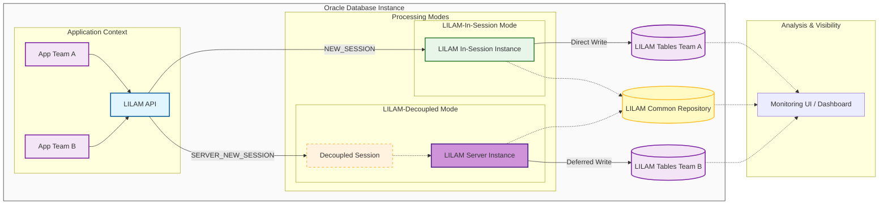

```mermaid

graph LR
    subgraph ODB ["Oracle Database Instance"]
        
        subgraph APP ["Application Context"]
            direction TB
            AppA[App Team A]
            AppB[App Team B]
            AppA & AppB --> API[LILAM API]
        end

        %% -- VERARBEITUNG --
        subgraph MODES ["Processing Modes"]
            direction TB
            subgraph IN-SESSION ["LILAM-In-Session Mode"]
                LI[LILAM In-Session Instance]
            end
            
            subgraph DECOUPLED ["LILAM-Decoupled Mode"]
                CNS[Decoupled Session] -.-> SRV[LILAM Server Instance]
            end
        end

        %% -- TABELLEN-STRUKTUR --
        MDBA[(LILAM Tables Team A)]
        MDBS[(LILAM Common Repository)]
        MDBB[(LILAM Tables Team B)]
    end

    %% API Verbindungen
    API -->|NEW_SESSION| LI
    API -->|SERVER_NEW_SESSION| CNS
    
    %% Datenfluss zu den Tabellen (Linienführung optimiert)
    LI -->|Direct Write| MDBA
    LI -.-> MDBS
    
    SRV -.-> MDBS
    SRV -->|Deferred Write| MDBB

    subgraph MON_UI ["Analysis & Visibility"]
        UI[Monitoring UI / Dashboard]
    end

    %% Monitoring-Anbindung
    MDBA & MDBS & MDBB -.-> UI

    %% Styles
    style AppA fill:#f3e5f5,stroke:#7b1fa2,stroke-width:2px
    style AppB fill:#f3e5f5,stroke:#7b1fa2,stroke-width:2px
    style API fill:#e1f5fe,stroke:#01579b,stroke-width:2px
    style LI fill:#e8f5e9,stroke:#2e7d32,stroke-width:2px
    style SRV fill:#ce93d8,stroke:#4a148c,stroke-width:2px
    style CNS fill:#fff3e0,stroke:#ff9800,stroke-dasharray: 5 5
    style MDBA fill:#f3e5f5,stroke:#7b1fa2,stroke-width:2px
    style MDBB fill:#f3e5f5,stroke:#7b1fa2,stroke-width:2px
    style MDBS fill:#fff9c4,stroke:#fbc02d,stroke-width:2px
    style ODB fill:#fafafa,stroke:#333,stroke-width:1px

```

