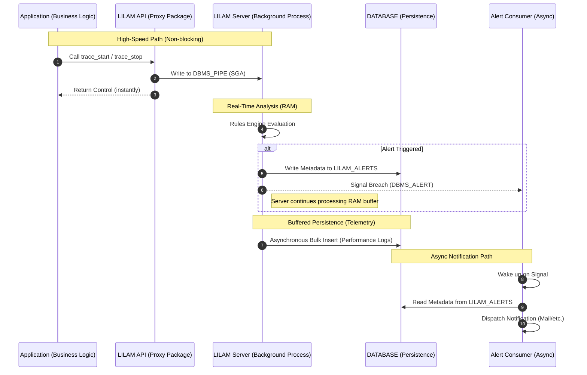

# Asynchronous Alerting Architecture

## Overview

To maintain high throughput (> 2,500 EPS), LILAM strictly decouples event analysis from notification dispatch. This prevents external latencies (e.g., SMTP handshakes) from impacting the core processing loop.

* **Responsiveness (RAM-First):** LILAM prioritizes immediate alerting over persistence. Alerts are triggered directly from the RAM-resident Rules Engine via [DBMS_ALERT].
* **High-Throughput Buffering:** To maintain > 2,500 EPS, event persistence is decoupled and buffered. Data is flushed to the `MONITOR_TABLES` asynchronously with a controlled delay (up to 1.8s), ensuring disk I/O never bottlenecks the real-time analysis.

To ensure no alert is ever lost, LILAM follows a Write-then-Signal pattern. When a rule violation is detected, the server immediately persists the alert metadata to the `LILAM_ALERTS` table before signaling the asynchronous consumer. This guarantees that the consumer always finds a valid record to process upon wakeup, maintaining high reliability even under heavy load.

### Alert Handshake Workflow


> **Note:** LILAM rules are not limited to error detection. They can also be used to track positive business milestones or validate complex event sequences (e.g., "Event B must follow Event A within X seconds").

---
## Configuration
Rules define how LILAM validates incoming signals. Each rule names the signal type it reacts to (trigger), the action it applies to, a condition and the alert to raise when the condition is met. A rule can report a problem (threshold breach) as well as a positive milestone or the expected order of events.

Rules are organized into Rule Sets, stored as JSON documents in the `LILAM_RULES` table. A rule set consists of a header and an array of rules.

> [!IMPORTANT]
> Rules are evaluated by LILAM **servers** of the group (dispatchers do not evaluate rules) and by INSESSION processes started with `NEW_SESSION(..., p_groupName => ...)`. INSESSION processes without a group have no rules. See [Rules in INSESSION Mode](../docs/architecture%20and%20concepts.md#rules-in-insession-mode).

### Rule Set Structure
| Property | Type | Required | Description
| :-- | :-- | :-- | :--
| header | object | no | metadata for the rule set
| header.rule_set | string | no | name of the rule set (informational; LILAM uses `LILAM_RULES.SET_NAME`)
| header.rule_set_version | number | no | version (informational; LILAM uses `LILAM_RULES.VERSION`)
| header.description | string | no | human-readable purpose or hints
| rules | array | yes | the individual rule definitions (may be empty)
| rules.id | string | yes | unique identifier within the rule set, max. 50 characters (e.g., SEQ-001)
| rules.trigger_type | enum | yes | the signal that starts the evaluation¹
| rules.action | string | yes² | name of the action, event or process the rule applies to, max. 100 characters
| rules.context | string | no | restricts the rule to one context of the action³, max. 100 characters
| rules.condition.operator | enum | yes | the check to apply (see [Operators](#operators))
| rules.condition.value | string | depends | parameter of the operator; numbers use a decimal point (`0.5`)
| rules.condition.metric | string | no | informational only
| rules.alert.handler | string | yes | name of the `DBMS_ALERT` signal the consumer listens to, max. 30 characters
| rules.alert.severity | string | no | severity passed to the consumer, max. 30 characters
| rules.alert.throttle_seconds | number | no | minimum seconds before the same rule fires again for the same action and baseline scope (default 0)

¹ The trigger type maps to the LILAM API call that produced the signal, see [Hooks / Trigger Types](#hooks--trigger-types).

² For process triggers the action is the process name. For `LOGGING` rules the action may be omitted (it is always `LOGGING`).

³ The context allows different thresholds for instances of the same action, e.g. a speed limit only for track section `SECTION_400_001`. A rule with context applies only to this context; a rule without context applies to **all** contexts of the action. If both exist, both are evaluated.

```json
    {
      "id": "SEQ-003",
      "_comment": "The ride never takes longer than 25 seconds. Something stopped the train.",
      "trigger_type": "TRACE_STOP",
      "action": "TRACK_SECTION",
      "context": "SECTION_400_001",
      "condition": {
        "operator": "MAX_DURATION_MS",
        "value": "25000"
      },
      "alert": { "handler": "LILAM_ALERT_MAIL_LOG", "severity": "WARN", "throttle_seconds": 0 }
    }
```

Unknown properties (e.g. `_comment`) are ignored.

### Validation when loading
A server checks a rule set completely before it uses it: required fields, lengths, unique ids, known trigger types and operators, operators allowed for the trigger, and the format of `condition.value`. If a single rule is invalid, the **whole** rule set is rejected and the previously loaded rules stay active. `SERVER_UPDATE_RULES` performs the same check before it activates a rule set and raises an exception with the reason; a server that rejects a rule set at startup writes the reason to `LILAM_LOG_INTERNAL` and to the log of the server process.

### Hooks / Trigger Types
| hook | scope | API call
| :-- | :-- | :--
| PROCESS_START | Process | `NEW_SESSION` / `SERVER_NEW_SESSION`
| PROCESS_UPDATE | Process | `SET_PROCESS_STATUS`, `SET_PROC_STEPS_TODO`, `SET_PROC_STEPS_DONE`, `PROC_STEP_DONE`, ...
| PROCESS_STOP | Process | `CLOSE_SESSION` (sees the values passed to `CLOSE_SESSION`)
| MARK_EVENT | Event | `MARK_EVENT`
| TRACE_START, TRACE_STOP | Transaction | `TRACE_START`, `TRACE_STOP`
| LOGGING | Logging | `ERROR`, `WARN`, `INFO`, `DEBUG`, ...

### Operators
| operator | value | allowed triggers | fires when
| :-- | :-- | :-- | :--
| ON_START, ON_STOP, ON_EVENT, ON_UPDATE | – | all except LOGGING | always (the trigger itself is the condition)
| SEVERITY | `ERROR`, `WARN`, `MONITOR`, `INFO`, `DEBUG` | LOGGING | a log message with exactly this level arrives
| LOG_CONTAINS | `TEXT` or `LEVEL\|TEXT` | LOGGING | a log message contains the text (case-insensitive), optionally only for this level (`ERROR`, `WARN`, `MONITOR`, `INFO`, `DEBUG`; otherwise the whole value is the text)
| MAX_DURATION_MS | milliseconds | MARK_EVENT, TRACE_STOP | duration of the trace, or for events the time since the previous event of the same action, is greater than the value
| AVG_DEVIATION_PCT | `pct[\|warmup[\|alpha]]` | MARK_EVENT, TRACE_STOP | duration is more than `pct` percent above the moving average (EWMA); no evaluation while the average is below 1 ms (measurement resolution), see below
| MAX_OCCURRENCE | count | MARK_EVENT, TRACE_STOP, PROCESS_UPDATE, PROCESS_STOP | the action occurred more often than the value within the process (`ACTION_COUNT`); for processes: `STEPS_DONE` > value
| MAX_GAP_SECONDS | seconds | MARK_EVENT, TRACE_START | time since the previous event (MARK_EVENT) or since the end of the previous trace (TRACE_START) of the same action is greater than the value
| PRECEDED_BY | `ACTION` or `ACTION\|CONTEXT` | MARK_EVENT, TRACE_START, PROCESS_UPDATE, PROCESS_STOP | the previous signal of the process was **not** the expected action (and context, if given)⁴
| PRECEDED_BY_WITHIN_SECS | `ACTION\|SECONDS` or `ACTION\|CONTEXT\|SECONDS` | like PRECEDED_BY | like PRECEDED_BY, or the expected predecessor ended more than the given seconds ago
| RUNTIME_EXCEEDED | milliseconds | PROCESS_UPDATE | the running process is older than the value
| MAX_RUNTIME_EXCEEDED | milliseconds | PROCESS_STOP | the total runtime of the process is greater than the value
| STEPS_LEFT_HIGH | count | PROCESS_START, PROCESS_UPDATE, PROCESS_STOP | `STEPS_TODO - STEPS_DONE` > value
| SUCCESS_RATE_LOW | percent | PROCESS_START, PROCESS_UPDATE, PROCESS_STOP | `STEPS_DONE / STEPS_TODO * 100` < value
| STATUS_EQUALS | number | PROCESS_START, PROCESS_UPDATE, PROCESS_STOP | process status = value
| INFO_CONTAINS | text | PROCESS_START, PROCESS_UPDATE, PROCESS_STOP | process info contains the text (case-insensitive)

⁴ Only events and traces (start and stop) count as predecessors, log messages do not. Without a context in the value, any context of the expected action is accepted. The order is checked when the action starts, not at TRACE_STOP (there the predecessor would usually be the own TRACE_START); loading rejects `PRECEDED_BY*` with TRACE_STOP.

> [!NOTE]
> Rules are evaluated when a signal arrives. LILAM has no timer-based evaluation: a process that hangs without sending signals, or an event that never arrives ("B must follow A within X seconds" when B never comes), is not detected. The order "B follows A within X seconds" can be checked when B arrives, with `PRECEDED_BY_WITHIN_SECS` on B.

---
## Table: LILAM_RULES
This table serves as the central repository for all rule sets. Each rule set is stored as a versioned JSON document for a **server group**; the same rule set may be stored for several groups. Per group exactly one row is active.

| Column | Type | Description |
| :--- | :--- | :--- |
| **GROUP_NAME** | `VARCHAR2(50)` | Server group the rule set belongs to. |
| **SET_NAME** | `VARCHAR2(30)` | Name of the rule set. `GROUP_NAME`, `SET_NAME` and `VERSION` together are unique. |
| **VERSION** | `NUMBER` | Version number to support testing, staging, and rollbacks. |
| **IS_ACTIVE** | `NUMBER(1)` | `1` for the rule set the servers of the group use (at most one per group). |
| **RULE_SET** | `CLOB` | The JSON document (header and rules); checked by `IS JSON`. |
| **CREATED** | `TIMESTAMP` | When this version was created. |
| **AUTHOR** | `VARCHAR2(50)` | The developer or architect who defined the rule set. |

Alerts and the consumer refer to a rule by `GROUP_NAME`, `SET_NAME`, `VERSION` and `rules.id`.

> **Implementation Note**
> The LILAM servers load the active rule set of their group into RAM at startup (or when `SERVER_UPDATE_RULES` is called). All rule evaluations work on this cached structure, without database access. Only a firing rule writes to `LILAM_ALERTS`.

---
## Loading a Rule Set

`SERVER_UPDATE_RULES` checks the rule set of the group, makes it the active one and tells every running server of the group (dispatchers excluded) to reload it. A group without running servers is not an error: every server loads the active rule set of its group at startup, including newly added servers.

```sql
INSERT INTO LILAM_RULES (group_name, set_name, version, created, author, rule_set)
VALUES ('METRO', 'METRO_RULES', 2, systimestamp, 'Dirk', '{"rules":[ ... ]}');

exec LILAM.SERVER_UPDATE_RULES(p_groupName => 'METRO', p_ruleSetName => 'METRO_RULES', p_ruleSetVersion => 2);
```

A missing or invalid rule set raises `NUM_ERR_RULE_SET` (-20130) with the reason; nothing is changed.

---

## Performance
Evaluating rules happens in RAM and is cheap: rules for other actions cost nothing measurable, about 6 µs per signal for each rule on the same action. A **firing** rule costs several milliseconds (insert into `LILAM_ALERTS`, commit, `DBMS_ALERT.SIGNAL`). Use `throttle_seconds` for rules that may fire often.

### Deep Dive: Anomaly Detection with EWMA

The `AVG_DEVIATION_PCT` operator utilizes an **Exponentially Weighted Moving Average (EWMA)**. Unlike a simple arithmetic mean, the EWMA gives more weight to recent data points, allowing the system to adapt to shifting performance trends in real-time.

#### What is EWMA?
It is a statistical measure used to model time-series data. In LILAM, it creates a "moving baseline" for your business transactions. If a new event deviates significantly from this baseline, an alert is triggered.

#### Technical Example: `20|100|0.1`
When using `AVG_DEVIATION_PCT` with the value `20|100|0.1`, the parameters are defined as follows:


| Parameter | Value | Description |
| :--- | :--- | :--- |
| **Tolerance** | `20` | Trigger an alert if the deviation is > 20% from the average. |
| **Warm-up** | `100` | Minimum number of initial events needed to build a stable baseline before alerting starts. |
| **Smoothing (Alpha)** | `0.1` | The weight of the latest event (10%). A lower value makes the average more stable; a higher value makes it more reactive to sudden changes. |


If `warmup` or `alpha` are omitted, LILAM uses warm-up 3 and alpha 0.1. During the warm-up the rule does not fire.
