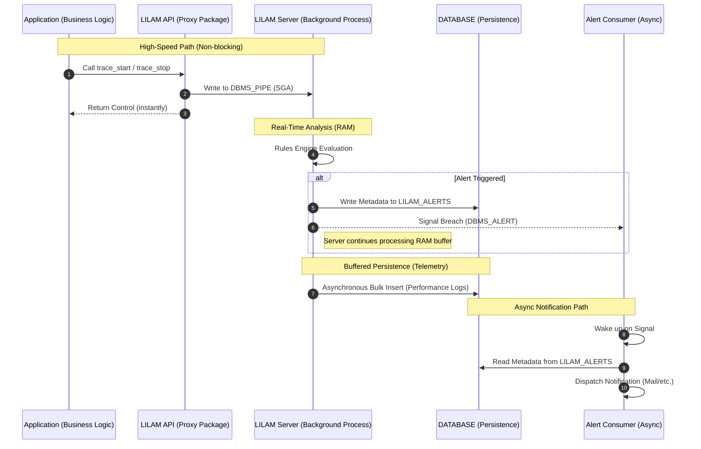

# Asynchronous Alerting Architecture

## Overview

To maintain high throughput (> 2,500 EPS), LILAM strictly decouples event analysis from notification dispatch. This prevents external latencies (e.g., SMTP handshakes) from impacting the core processing loop.

* **Responsiveness (RAM-First):** LILAM prioritizes immediate alerting over persistence. Alerts are triggered directly from the RAM-resident Rules Engine via [DBMS_ALERT].
* **High-Throughput Buffering:** To maintain > 2,500 EPS, event persistence is decoupled and buffered. Data is flushed to the `MONITOR_TABLES` asynchronously with a controlled delay (up to 1.8s), ensuring disk I/O never bottlenecks the real-time analysis.

To ensure no alert is ever lost, LILAM follows a Write-then-Signal pattern. When a rule violation is detected, the server immediately persists the alert metadata to the `LILAM_ALERTS` table before signaling the asynchronous consumer. This guarantees that the consumer always finds a valid record to process upon wakeup, maintaining high reliability even under heavy load.

### Alert Handshake Workflow


> **Note:** LILAM rules are not limited to error detection. They can also be used to track positive business milestones or validate complex event sequences (e.g., "Event B must follow Event A within X seconds").

---
## Configuration
Rules define how LILAM validates incoming events. Each rule shares a common set of parameters that specify which event type to monitor, the evaluation criteria to apply, and the corresponding action to take when a rule is triggered (e.g., notifying on a threshold breach or confirming an expected sequence of events).
Rules are organized into Rule Sets, which are stored as JSON objects in the LILAM_RULES table. Within these JSON objects, individual rules are managed as structured arrays for efficient processing.

### Rule Set Structure
| Property | Type | Description
| :-- | :-- | :--
| header | object | metadata for the rule set
| header.rule_set | string | unique name of rule set
| header.rule_set_version | number | version identifier (e.g., for testing or staging)
| header.description | string | human-readable purpose or hints for the rule set
| rules | array | a collection of individual rule definitions
| rules.id | string | unique identifier for the rule (e.g., SEQ-001)
| rules.trigger_type | enum | specific hook or lifecycle stage that activates the rule evaluation¹
| rules.action | string | the name of the event or action to monitor
| rules.context | string | optional filter to narrow down a rule to a specific instance²
| rules.condition | object | container for validation logic
| rules.condition.operator | string | the logic/filter to be applied
| rules.condition.value | string | parameter for the operator (number, range, or combined values)
| rules.alert | object | metadata for alert handling
| rules.alert.handler | string | the downstream process designated to handle the alert
| rules.alert.severity | enum | severity level passed to the alert handler
| rules.alert.throttle | number | minimum seconds to wait before re-triggering the same alert

### Hooks
| hook | event type | effect
| :-- | :-- | :--
| ON_EVENT, ON_START, ON_STOP | Event, Transaction, Process | generic triggers for reacting to incoming signals
| ON_UPDATE, PROCESS_START, PROCESS_STOP | Process | specific triggers for process lifecycle changes

### Operators
| operator | value / unit | scope | description
| :-- | :-- | :-- | :--
| AVG_DEVIATION_PCT | percent | all | detects duration anomalies using **EWMA**
| MAX_DURATION_MS | milliseconds | Event, Transaction | maximum allowed duration between signals
| MAX_OCCURRENCE | count | Event, Transaction | max allowed number of consecutive signals per action/context
| MAX_GAP_SECONDS | seconds | Event, Transaction | max time elapsed between the previous and current signal
| PRECEDED_BY | name and context | all | validates if the direct predecessor matches the condition
| PRECEDED_BY_WITHIN_MS | name and context and milliseconds | all | extends PRECEDED_BY with a maximum time constraint

¹ The trigger_type acts as a filter to determine when a rule is evaluated. It maps to core LILAM API calls, such as starting a transaction (TRACE_START), reaching a milestone (MARK_EVENT), or completing a process (PROCESS_STOP).
² The context field allows you to apply rules more selectively. Use it to differentiate between various instances of the same action. This is particularly useful when different thresholds or SLAs apply to specific locations or segments (e.g., a "Speed Limit" rule that only applies to a specific track section).
For example rule SEQ-003 only monitors travel times for the specific track segment SECTION_400_001, rather than every segment on the line.

### Deep Dive: Anomaly Detection with EWMA

The `AVG_DEVIATION_PCT` operator utilizes an **Exponentially Weighted Moving Average (EWMA)**. Unlike a simple arithmetic mean, the EWMA gives more weight to recent data points, allowing the system to adapt to shifting performance trends in real-time.

#### What is EWMA?
It is a statistical measure used to model time-series data. In LILAM, it creates a "moving baseline" for your business transactions. If a new event deviates significantly from this baseline, an alert is triggered.

#### Technical Example: `20|100|0.1`
When using `AVG_DEVIATION_PCT` with the value `20|100|0.1`, the parameters are defined as follows:


| Parameter | Value | Description |
| :--- | :--- | :--- |
| **Tolerance** | `20` | Trigger an alert if the deviation is > 20% from the average. |
| **Warm-up** | `100` | Minimum number of initial events needed to build a stable baseline before alerting starts. |
| **Smoothing (Alpha)** | `0.1` | The weight of the latest event (10%). A lower value makes the average more stable; a higher value makes it more reactive to sudden changes. |

```json
    {
      "id": "SEQ-003",
	  "_comment": "Mehr als 25 Sekunden dauert die Fahrt nicht. Irgendetwas hat den Zug aufgehalten.",
      "trigger_type": "TRACE_STOP",
      "action": "TRACK_SECTION",
      "context": "SECTION_400_001"
      "condition": {
        "operator": "MAX_DURATION_MS",
        "value": "25000"
      },
      "alert": { "handler": "MAIL_LOG", "severity": "WARN", "throttle_seconds": 0 }
    }

```
---
## Table: LILAM_RULES
This table serves as the central repository for all rule sets. Each rule set is stored as a single, versioned JSON document, allowing for flexible and dynamic rule management.

| Column | Type | Description |
| :--- | :--- | :--- |
| **SET_NAME** | `VARCHAR2(30)` | Primary Key. The unique identifier for the rule set. |
| **VERSION** | `NUMBER` | Version number to support testing, staging, and rollbacks. |
| **RULE_SET** | `CLOB` | The core configuration: A JSON object containing the header and the array of rule definitions. |
| **CREATED** | `TIMESTAMP` | Audit timestamp: When this specific version was created. |
| **AUTHOR** | `VARCHAR2(50)` | Attribution: The developer or architect who defined the rule set. |


> ** Implementation Note **
> The LILAM servers load the `RULE_SET` JSON into RAM at startup (or upon manual refresh). This minimizes database I/O during high-speed event processing, as all rule evaluations are performed against the cached > memory structure.

---
## Loading a Rule Set

LILAM servers support dynamic rule set updates at runtime. Active configurations are persisted in the `LILAM_SERVER_REGISTRY`, ensuring that servers automatically reload the correct rule sets upon restart:
```sql
exec LILAM.SERVER_UPDATE_RULES(p_processId => 1202, p_ruleSetName => 'METRO Rules', p_ruleSetVersion => 2);
```

